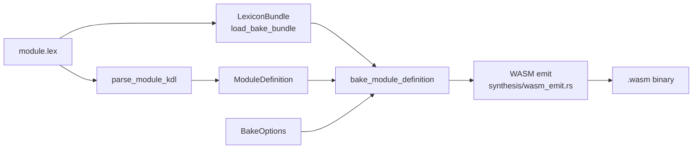

# Compiler

`laplan-compile` owns the Petri net solver and WASM binary emit. `laplan-inverse` provides the inverse functor. The inverse functor has a three-layer structure: type declaration level covers all languages, function/trait extraction is Rust-specific, and WASM is an independent path. Details are in the latter half of this page.

## laplan-compile Structure

```
compiler/compile/src/
├── api.rs              # solve, marking_from_json, SolveOutput
├── assessment.rs       # NeedAssessment, BoundaryKind
├── axiom_table.rs      # TransitionTable, Recipe, morphisms_to_transitions
├── bundle.rs           # #[cfg(feature = "bundle")] bundled TransitionTable
├── concurrency.rs      # ParallelDag, are_independent, has_dependency
├── convert.rs          # type conversion helpers
├── diagnose.rs         # convergence diagnosis, Dead/Orphan detection
├── fact.rs             # Fact, Goal, Marking, InstructionFact
├── lint.rs             # Layer 0 static checks
└── solver.rs           # BFS core, SearchConfig, SolveMode
```

### Key Public API Types

```rust
pub enum SolveOutput {
    Ok(Vec<Recipe>),
    AlreadySatisfied,
    PreflightRequired { recipe: Recipe, axiom_nsids: Vec<String> },
    AmbiguousAxiomCrossing { candidates: Vec<Recipe>, axiom_nsids: Vec<String> },
    NeedsUserAction(Vec<Fact>),
    Boundary(BoundaryKind),
    InvalidGoalSpec { goal_spec: String },
}

pub struct SearchConfig {
    pub allow_duplicate_steps: bool,
    pub enumerate_all: bool,
}

pub enum SolveMode { Execute, DryRun }
```

For solver details, see [architecture/solver.md](solver.md).

### Feature Gate

| Feature | Enabled functionality |
|---|---|
| `bundle` (default) | `TransitionTable` construction from vendored-json via `bundled_table()` |

`--no-default-features` enables WASM builds where the caller constructs the `TransitionTable` directly.

## WASM Binary Generation Pipeline

`synthesis/src/bake.rs` assembles the WASM module in cooperation with `laplan-compile`.



### BakeOptions

```rust
pub struct BakeOptions {
    pub simd: bool,              // --simd: SIMD optimization
    pub parallel: bool,          // --parallel: embed parallel execution DAG
    pub parallel_target: VectorizeTarget,
    pub constant_time: bool,     // --constant-time: timing attack resistance
}
```

CLI flag mapping:

| Flag | Meaning | Requires |
|---|---|---|
| `--bake` | Bake module into WASM | `emit-wasm` subcommand |
| `--simd` | Rewrite with `v128` vector operations | `--bake` |
| `--parallel` | Embed `ParallelDag` for parallelization | `--bake` |
| `--constant-time` | Avoid branches and table lookups | `--bake` |
| `--bind <typescript\|python>` | Generate language bindings for WASM | `--bake` |
| `--server-output` | Generate server implementation stub | `--bake` |

### WASM Emit Layer

`synthesis/src/wasm_emit.rs` and `wasm_lower.rs` convert Lex₂ IR (`Stmt` / `Expr`) to WASM bytecode.

| Type | Role |
|---|---|
| `WasmValType` (`I32`/`I64`/`F32`/`F64`/`V128`) | Value type |
| `WasmFuncType` | Function signature (params + results + locals) |
| `WasmImport` / `WasmExport` | Import / export entries |
| `WasmModule` | Completed WASM module |

`wasm_bindgen_output.rs` generates TypeScript and Python bindings.

## Derives Expansion

Declarations such as `derives { vectorize f32 4; ... }` written in `axiom/` rules are expanded into concrete transitions by `synthesis/src/derives_resolve.rs`.

| Derive | Effect |
|---|---|
| `vectorize <type> <count>` | Automatically derives SIMD / parallel variants from per-element axioms |
| `family.product` | Derives per-component operations from family members |
| `lift` / `compose` | Composition via categorical primitives |

Expansion results are added to the `TransitionTable` and become selectable paths for the solver.

## laplan-inverse: Inverse Functor

The inverse functor extracts a `.lex` skeleton from generated code and verifies design validity through roundtrip conversion. The current structure has three layers with differing coverage per layer.

```
compiler/inverse/src/
├── extract.rs           # Rust source pub API extraction (syn, Rust-specific)
├── convert.rs           # PublicApi → LexiconIr skeleton (Rust-specific)
├── emit.rs              # LexiconIr → .lex text (language-agnostic)
├── template_inverter.rs # Reverse application of mapping.lex templates (language-agnostic)
├── inverse_type_table.rs
├── wasm_read.rs         # WASM Type/Import/Export section parsing
├── wasm_inverse.rs      # WASM types → Lexicon types
└── roundtrip_tests.rs
```

### Three-Layer Responsibilities

| Layer | Input | Approach | Coverage |
|---|---|---|---|
| Type declaration inverse (product / sum / alias) | Generated code | Regex-based reverse application of `syntax {}` in mapping.lex | **All languages with mapping.lex** (declaration-driven) |
| Function / trait / impl method extraction | Rust source | AST analysis with `syn` | Rust only (Rust-specific) |
| WASM binary → type recovery | `.wasm` | Direct section reading | WASM independent |

`TemplateInverter::new(syntax, type_table)` in `template_inverter.rs` is a declaration-driven implementation that accepts `MappingSyntax`. `extract_product` / `extract_sum` / `extract_alias` operate across all 21 languages. Tests include both `make_rust_inverter()` and `make_python_inverter()`.

### Public Entry Point

```rust
pub fn generate_inverse_output(
    crate_src_dir: &Path,
    namespace: &str,
    type_table: &InverseTypeTable,
) -> Result<InverseOutput, String>;
```

Processing flow:

1. `collect_rust_source_files(crate_src_dir)` scans Rust source files.
2. `extract_public_api_with_source_name` extracts pub functions and types using `syn`.
3. `convert` transforms PublicApi into a LexiconIr skeleton.
4. `emit_lex_with_warnings` generates `.lex` text (with accompanying warnings).

Output receives the `INVERSE_HEADER` automatically (see [parser.md](parser.md)).

### Coverage

Type declaration inverse (product / sum / alias) is mapping.lex-driven and covers all 21 languages. The public entry point accepts only Rust source.

### Structural Categories Subject to Inverse Conversion

Beyond type declarations, the major `.lex` structures map to synthesis output as follows. Recovering these defines the completeness criteria for inverse conversion.

| .lex structure | Language-side output | Recovery path |
|---|---|---|
| `type` | Built-in type reference | Reverse lookup of `type_map` in mapping.lex |
| `lexicon` (procedure / query / subscription) | Endpoint handler function / trait method | Reverse lookup of `handler {}` section in mapping.lex |
| `lexicon` (object / record) | struct / data class | Reverse lookup of `syntax { product }` |
| sum / union | enum / sealed / tagged union | Reverse lookup of `syntax { sum }` |
| alias | type alias / newtype | Reverse lookup of `syntax { alias }` |
| `rule` conditional constraint | if / match / guard / precondition | Reverse lookup of `control { if }` / handler guard-prefix |
| `morph.chain` | Function composition / pipeline / method chain | Reverse lookup of `control { fn }` + chain-step template |
| `const` / `assign` | Constant / mutable binding | Reverse lookup of `variable { binding, mutable-binding }` |
| `func.law` / `dual` / `invariant` | Does not appear in normal code | Not covered (reported explicitly as warning) |

`TemplateInverter` covers the three categories: product / sum / alias. Inverse conversion for endpoint / rule-guard / chain / const / assign is reported as `InverseWarning`.

### Roundtrip Tests

`roundtrip_tests.rs` and `wasm_roundtrip_tests.rs` verify that the result of `.lex` → synthesis → inverse matches the original `.lex`. The `atproto-core-tests` feature gates AT Protocol core-specific tests.

Multi-language roundtrip tests in `roundtrip_tests.rs` / `wasm_roundtrip_tests.rs` cover product / sum / alias.

## Network Fetch

`ir::github_fetch` (feature = "filesystem") can fetch cratis from GitHub. This is used when a cratis specifies a GitHub URL instead of a `path`.
