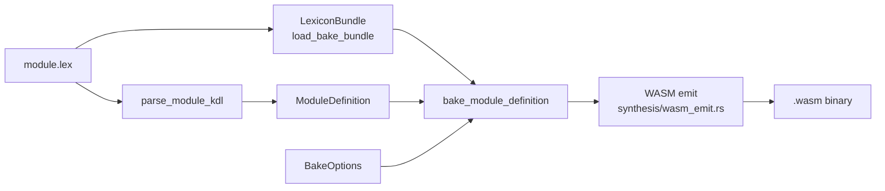

# Compiler

`laplan-compile` owns the Petri net solver and WASM binary emit. `laplan-inverse` provides the inverse functor. The inverse functor has a three-layer structure: type declaration level covers all languages, function/trait extraction is Rust-specific, and WASM is an independent path. Details are in the latter half of this page.

## laplan-compile Structure

```
compiler/compile/src/
├── api.rs              # solve, marking_from_json, SolveOutput
├── assessment.rs       # NeedAssessment, BoundaryKind
├── axiom_table.rs      # TransitionTable, Recipe, morphisms_to_transitions
├── bundle.rs           # #[cfg(feature = "bundle")] bundled TransitionTable
├── concurrency.rs      # ParallelDag, are_independent, has_dependency
├── convert.rs          # type conversion helpers
├── diagnose.rs         # convergence diagnosis, Dead/Orphan detection
├── fact.rs             # Fact, Goal, Marking, InstructionFact
├── lint.rs             # Layer 0 static checks
└── solver.rs           # BFS core, SearchConfig, SolveMode
```

### Key Public API Types

```rust
pub enum SolveOutput {
    Ok(Vec<Recipe>),
    AlreadySatisfied,
    PreflightRequired { recipe: Recipe, axiom_nsids: Vec<String> },
    AmbiguousAxiomCrossing { candidates: Vec<Recipe>, axiom_nsids: Vec<String> },
    NeedsUserAction(Vec<Fact>),
    Boundary(BoundaryKind),
    InvalidGoalSpec { goal_spec: String },
}

pub struct SearchConfig {
    pub allow_duplicate_steps: bool,
    pub enumerate_all: bool,
}

pub enum SolveMode { Execute, DryRun }
```

For solver details, see [architecture/solver.md](solver.md).

### Feature Gate

| Feature | Enabled functionality |
|---|---|
| `bundle` (default) | `TransitionTable` construction from vendored-json via `bundled_table()` |

`--no-default-features` enables WASM builds where the caller constructs the `TransitionTable` directly.

## WASM Binary Generation Pipeline

`synthesis/src/bake.rs` assembles the WASM module in cooperation with `laplan-compile`.


```mermaid
flowchart LR
    module[module.lex]
    bundle[LexiconBundle<br/>load_bake_bundle]
    parse[parse_module_kdl]
    def[ModuleDefinition]
    opts[BakeOptions]
    bake[bake_module_definition]
    emit[WASM emit<br/>synthesis/wasm_emit.rs]
    wasm[.wasm binary]

    module --> parse --> def
    module --> bundle
    bundle --> bake
    def --> bake
    opts --> bake
    bake --> emit --> wasm
```

### BakeOptions

```rust
pub struct BakeOptions {
    pub simd: bool,              // --simd: SIMD optimization
    pub parallel: bool,          // --parallel: embed parallel execution DAG
    pub parallel_target: VectorizeTarget,
    pub constant_time: bool,     // --constant-time: timing attack resistance
}
```

CLI flag mapping:

| Flag | Meaning | Requires |
|---|---|---|
| `--bake` | Bake module into WASM | `emit-wasm` subcommand |
| `--simd` | Rewrite with `v128` vector operations | `--bake` |
| `--parallel` | Embed `ParallelDag` for parallelization | `--bake` |
| `--constant-time` | Avoid branches and table lookups | `--bake` |
| `--bind <typescript\|python>` | Generate language bindings for WASM | `--bake` |
| `--server-output` | Generate server implementation stub | `--bake` |

### WASM Emit Layer

`synthesis/src/wasm_emit.rs` and `wasm_lower.rs` convert Lex₂ IR (`Stmt` / `Expr`) to WASM bytecode.

| Type | Role |
|---|---|
| `WasmValType` (`I32`/`I64`/`F32`/`F64`/`V128`) | Value type |
| `WasmFuncType` | Function signature (params + results + locals) |
| `WasmImport` / `WasmExport` | Import / export entries |
| `WasmModule` | Completed WASM module |

`wasm_bindgen_output.rs` generates TypeScript and Python bindings.

## Derives Expansion

Declarations such as `derives { vectorize f32 4; ... }` written in `axiom/` rules are expanded into concrete transitions by `synthesis/src/derives_resolve.rs`.

| Derive | Effect |
|---|---|
| `vectorize <type> <count>` | Automatically derives SIMD / parallel variants from per-element axioms |
| `family.product` | Derives per-component operations from family members |
| `lift` / `compose` | Composition via categorical primitives |

Expansion results are added to the `TransitionTable` and become selectable paths for the solver.

## laplan-inverse: Inverse Functor

The inverse functor extracts a `.lex` skeleton from generated code and verifies design validity through roundtrip conversion. Two routes, `ast_inverse/` and `wasm/`, feed `emit.rs` which produces `.lex` text, and `equiv.rs` checks logical equivalence.

```
compiler/inverse/src/
├── lib.rs                       # public entry points + re-exports
├── source.rs                    # SourceFile, InverseOutput, InverseWarning (shared types)
├── equiv.rs                     # LexiconIr logical equivalence check (for roundtrip tests)
├── emit.rs                      # .lex text generation (language-agnostic)
├── ast_inverse/                 # AST inverse pass shared across all 21 languages
│   ├── engine.rs                # AST pattern matcher + recursive body matcher
│   │                            # + control-flow parser (if/for/while/match)
│   │                            # + Expr structuring parser (method chain / match / if-let-test / guarded pattern)
│   ├── mapping_driver.rs        # adapter that drives mapping.lex pattern sections
│   │                            # (control / variable / handler / endpoint / functional)
│   ├── type_table.rs            # InverseTypeTable (type_map reverse lookup)
│   ├── product.rs / sum.rs / alias.rs
│   ├── control.rs               # if/for/fn/module/match
│   ├── variable.rs              # binding/mutable-binding/assign/return
│   ├── handler.rs               # endpoint handler (stores body: Vec<Stmt>)
│   └── rule_chain.rs            # rule precondition / chain morphism recovery
└── wasm/                        # WASM-specific (direct section reading)
    ├── read.rs                  # WASM Type/Import/Export section parsing
    └── inverse.rs               # WASM types → Lexicon types
```

### Two Routes

| Route | Input | Approach | Coverage |
|---|---|---|---|
| AST inverse pass (`ast_inverse/`) | Generated source | `engine.rs` reverse-looks up FnExpr / Stmt / Expr patterns while `mapping_driver.rs` drives the `syntax` + `expr {}` dual schema in mapping.lex | **All 21 languages** (mapping.lex-driven) |
| WASM binary → type recovery (`wasm/`) | `.wasm` | Direct section reading | WASM independent |

`ast_inverse` recovers product / sum / alias type declarations plus endpoint / rule-guard / chain / const / assign via the `control` / `variable` / `handler` / `rule_chain` passes. The `mapping_driver` registry drives five driver kinds (control / variable / handler / endpoint / functional) from the pattern sections of mapping.lex. `equiv.rs` provides `assert_lex_equivalent` for logical equivalence judgments in roundtrip tests.

### Public Entry Points

```rust
// Language-agnostic entry (works for all 21 languages + wasm)
pub fn invert_source_to_lex(
    target: &str,
    mapping: &Mapping,
    sources: &[SourceFile],
    namespace: &str,
) -> Result<InverseOutput, InverseError>;

// Rust-facing thin wrapper (internally calls `invert_source_to_lex("rust", ...)`)
pub fn invert_rust_crate(
    crate_src_dir: &Path,
    mapping: &Mapping,
    namespace: &str,
    type_table: &InverseTypeTable,
) -> Result<InverseOutput, InverseError>;

// WASM entry
pub fn invert_wasm_binary(
    wasm_bytes: &[u8],
    namespace: &str,
) -> Result<InverseOutput, InverseError>;
```

`invert_source_to_lex` takes `Mapping` as a parameter to avoid a circular dependency between `inverse` and `synthesis`. The CLI side calls `cached_mapping(target)` and passes the result to inverse.

### Body structuring and `Stmt::Raw` fallback

The handler body recovered by `handler.rs` is held as `Vec<Stmt>`. Semantic extraction runs in three layers:

1. The recursive body matcher in `engine.rs` drives the `stmt {}` and `pattern {}` sections of mapping.lex and attempts per-statement pattern matching.
2. Control-flow forms not covered by patterns (`if` / `for` / `while` / `match`) are structured by dedicated parsers in engine (`parse_if_like` / `parse_for_like` / `parse_while_like` / `parse_match_like`).
3. The Expr structuring parser (`structure_expr`) promotes let right-hand sides and conditions into `Expr::MethodChain` / `Expr::Match` / `Expr::IfElse` / `Expr::IfLetTest` / `Expr::Construct` / `Expr::FieldAccess` / `Expr::Call`.

Fragments that none of these layers can structure fall through to `Stmt::Raw(String)` / `Expr::Raw(String)` / `Pattern::Raw(String)`, making the unhandled sites visible on the artifact. The design deliberately forgoes a `body_raw: String` shortcut: every failure surfaces as a Raw variant.

The engine's stmt-boundary detector tracks nesting depth for `(`, `{`, and `[`, so expression-statements that contain a closed block (`Self { ... }`, `Ok(Enum::Variant { ... })`, `match x { ... }`) are captured as a single stmt. A `strip_comments` preprocess removes line `//` and block `/* */` comments before body structuring, with string-literal tracking so `//` inside a string literal is preserved (doc comments `///` `//!` are handled via the field-doc path). `structure_expr` promotes `Self { ... }` / `Ok(...)` / `Err(...)` to `Expr::Construct` via mapping.lex `expr.variant.{construct-self, result-ok, result-err}`; `parse_let_complex` structures let RHS that is a `match` / `if-else` into `Expr::Match` / `Expr::IfElse` and let LHS of form `StructName { f1, f2 }` into `Pattern::Struct`. A trait definition body is detected as signature-only by `body_contains_implementation` and kept as an empty-body handler.

### Coverage

Inverse conversion is mapping.lex-driven and unified across all 21 languages. `invert_source_to_lex` is the language-agnostic entry; `invert_rust_crate` is a thin wrapper that calls `invert_source_to_lex("rust", ...)`. The `ast_inverse/` passes read the `syntax` sections and `expr {}` dual schema (pattern descriptions) from mapping.lex to recover product / sum / alias / endpoint / rule-guard / chain / const / assign.

### Structural Categories Subject to Inverse Conversion

Beyond type declarations, the major `.lex` structures map to synthesis output as follows. Recovering these defines the completeness criteria for inverse conversion.

| .lex structure | Language-side output | Recovery path |
|---|---|---|
| `type` | Built-in type reference | `ast_inverse::type_table` reverse-looks up `type_map` in mapping.lex |
| `lexicon` (procedure / query / subscription) | Endpoint handler function / trait method | Reverse lookup of `handler {}` section in mapping.lex |
| `lexicon` (object / record) | struct / data class | Reverse lookup of `syntax { product }` |
| sum / union | enum / sealed / tagged union | Reverse lookup of `syntax { sum }` |
| alias | type alias / newtype | Reverse lookup of `syntax { alias }` |
| `rule` conditional constraint | if / match / guard / precondition | Reverse lookup of `control { if }` / handler guard-prefix |
| `morph.chain` | Function composition / pipeline / method chain | Reverse lookup of `control { fn }` + chain-step template |
| `const` / `assign` | Constant / mutable binding | Reverse lookup of `variable { binding, mutable-binding }` |
| `func.law` / `dual` / `invariant` | Does not appear in normal code | Not covered (reported explicitly as warning) |

`ast_inverse` covers the full set of categories (product / sum / alias / endpoint / rule-guard / chain / const / assign) across all 21 languages. Structures that cannot be recovered are reported as `InverseWarning`.

### Roundtrip Tests

`roundtrip_tests.rs` and `wasm_roundtrip_tests.rs` verify that the result of `.lex` → synthesis → inverse matches the original `.lex`. The `atproto-core-tests` feature gates AT Protocol core-specific tests.

Multi-language roundtrip tests in `roundtrip_tests.rs` / `wasm_roundtrip_tests.rs` cover product / sum / alias.

## Network Fetch

`ir::github_fetch` (feature = "filesystem") can fetch cratis from GitHub. This is used when a cratis specifies a GitHub URL instead of a `path`.
