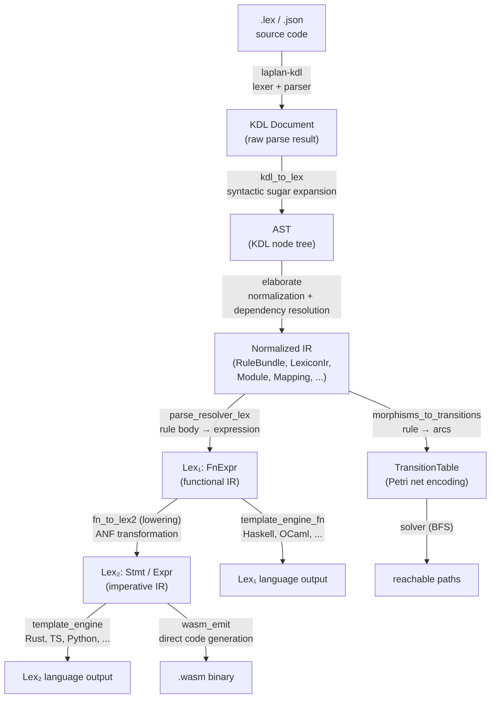
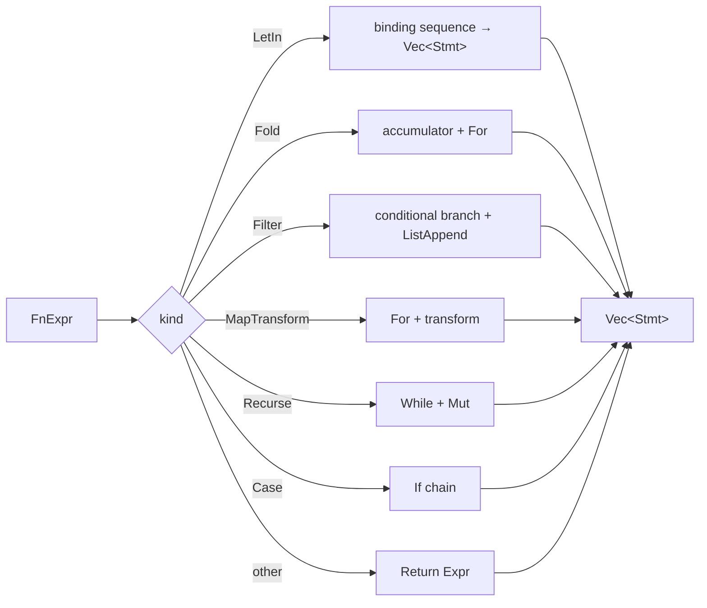

# Intermediate Representation

`laplan-ir` provides the normalized representation of `.lex` declarations and handles expressions and statements through a two-layer IR: Lex₁ (functional) and Lex₂ (imperative).

## IR Hierarchy Overview

Between the `.lex` source and the final output, the pipeline passes through five intermediate representation stages. Each stage discards specific information to produce a form suited to the next stage.



The Lex₁ → Lex₂ lowering and the IR → TransitionTable conversion are independent paths. From the same normalized IR, two different pieces of information are extracted for two different purposes: code generation and reachability analysis.

### What Each Stage Discards and Gains

| Stage | Representation | Discards | Gains |
|---|---|---|---|
| KDL Document | neco-kdl generic KDL nodes | - | Grammar correctness guarantee |
| AST | `.lex` semantic nodes | KDL syntax redundancy (`{`, `}`, `;`) | `.lex`-specific structure (rule, morph, family, etc.) |
| Normalized IR | RuleBundle, LexiconIr, etc. | Shorthand forms, syntactic sugar | Type connections, NSID resolution, normalized dependencies |
| Lex₁ (FnExpr) | Functional expression tree | Declaration structure | Pure expression semantics (let-in, fold, recurse) |
| Lex₂ (Stmt/Expr) | Imperative statement sequence | Nested expression structure | Sequential execution semantics (let, while, return) |
| TransitionTable | Petri net arcs | Function bodies | Type consumption and production relations only |

### Coexistence of the Lex₁ Path and Lex₂ Path

Conventional compilers follow a single path from high-level IR to low-level IR to target. laplan uses Lex₁ as the direct source for some languages (Haskell, OCaml, Gleam, Elixir) and lowers to Lex₂ for others (the remaining 17 languages + WASM). `has_functional_templates()` branches automatically based on whether a `functional {}` section exists in mapping.lex. See the "Lex₁ Path vs Lex₂ Path" section in [synthesis.md](synthesis.md).

## Key Types

### Declarations

| Type | Location | Role |
|---|---|---|
| `RuleBundle` | `rule.rs` | Collection of rule / const / assign / chain. Solver input. |
| `LexiconIr` | `lib.rs` | Normalized representation of lexicon declarations. `LexiconKind`, `LexiconObject`, `LexiconField`. |
| `Module` | `module.rs` | Aggregate for an entire `.lex` file. |
| `LibConfig` | `lib_config.rs` | cratis / face / member declarations. |
| `BuildConfig` | `build_config.rs` | Generation targets (`EmitTarget`, `BoundaryRule`). |
| `FamilyTable` | `family.rs` | family declarations (product, vectorize, etc.). |
| `Mapping` | `mapping.rs` | Language mapping (type_map, lowering, functional sections, etc.). |
| `RefinementDecl` | `refinement.rs` | Additional constraints on existing lexicons. |
| `VendorManifest` | `lib.rs` | vendored-json manifest. |

### Expressions and Statements

The IR represents functions in two layers. The functional expression written by the user as `rule.body` is received at Lex₁ and lowered to Lex₂ before being passed to code generation.

| Layer | Type | Use |
|---|---|---|
| Lex₁ | `FnExpr` (`fn_expr.rs`) | For functional languages (Haskell / OCaml / Gleam / Elixir) |
| Lex₂ | `Stmt` / `Expr` (`stmt_expr.rs`) | For imperative languages (remaining 17 languages + WASM) |

## Lex₁: FnExpr

Functional-style expression representation. Supports let-in, lambda, fold, filter, map-transform, case-of, Recurse (safe recursive), and more.

```rust
pub enum FnExpr {
    Var(String),
    StringLit(String),
    IntLit(i64),
    BoolLit(bool),
    App(String, Vec<FnExpr>),
    Lambda(Vec<(String, String)>, Box<FnExpr>),
    Fold { f, init, collection },
    Recurse { base_case, base_value, step, state },
    Filter(Box<FnExpr>, Box<FnExpr>),
    MapTransform(Box<FnExpr>, Box<FnExpr>),
    LetIn { bindings, body },
    Case { target, branches },
    FieldAccess(Box<FnExpr>, String),
    Construct(String, Vec<(String, FnExpr)>),
    ListLit(Vec<FnExpr>),
    MapFromList(Box<FnExpr>),
    MapLookup(Box<FnExpr>, Box<FnExpr>),
    MapMember(Box<FnExpr>, Box<FnExpr>),
    Null,
    IsNothing(Box<FnExpr>),
    FromMaybe(Box<FnExpr>, Box<FnExpr>),
    Not(Box<FnExpr>),
    BinaryOp(String, Box<FnExpr>, Box<FnExpr>),
    ErrorRaise(String),
    Tuple(Vec<FnExpr>),
    Fst(Box<FnExpr>),
    Snd(Box<FnExpr>),
    Head(Box<FnExpr>),
    NullCheck(Box<FnExpr>),
    Concat(Box<FnExpr>, Box<FnExpr>),
}
```

`Recurse` is the representation of safe recursive (`recursive.bounded` / `recursive.decreasing`). Lowering to While + Mut converts recursive patterns into loops.

### resolver.lex: KDL Notation for FnExpr

`axiom/resolver.lex` is a `.lex` variant that writes FnExpr directly in KDL. It declaratively defines the 7 runtime resolver functions (loadRecipes, dispatchRecipeStep, checkNeeds, classifyCandidate, executeRecipe, resolve, fetchGoal) and serves as the source of truth.

`parse_resolver_lex()` (`fn_expr.rs`) provides a semantic interpreter for KDL → `Vec<FnDef>`. The structure places a mapping layer to FnExpr variants on top of the KDL parser ([`neco-kdl`](https://github.com/barineco/neco-crates/tree/main/neco-kdl)) and uses only standard KDL syntax.

KDL node names correspond to key names in `functional {}` templates:

| KDL node | FnExpr variant | Child nodes |
|---|---|---|
| `fn "name" { ... }` | `FnDef` | `params`, `return-type`, `body` |
| `var "x"` | `Var` | - |
| `string "..."` | `StringLit` | - |
| `int 42` | `IntLit` | - |
| `bool #true` | `BoolLit` | - |
| `null-literal` | `Null` | - |
| `app "f" { arg { ... } }` | `App` | `arg` (multiple) |
| `lambda { params { ... } body { ... } }` | `Lambda` | `params`, `body` |
| `fold { fn { ... } init { ... } collection { ... } }` | `Fold` | `fn`, `init`, `collection` |
| `recurse { ... }` | `Recurse` | `base-case`, `base-value`, `step`, `state` |
| `filter { predicate { ... } collection { ... } }` | `Filter` | `predicate`, `collection` |
| `map-transform { transform { ... } collection { ... } }` | `MapTransform` | `transform`, `collection` |
| `let-in { binding "x" type="T" { value { ... } } body { ... } }` | `LetIn` | `binding` (multiple), `body` |
| `case { target { ... } branch constructor="C" { ... } }` | `Case` | `target`, `branch` (multiple) |
| `field "name" { target { ... } }` | `FieldAccess` | `target` |
| `construct "C" { field "f" { value { ... } } }` | `Construct` | `field` (multiple) |
| `list { item { ... } }` | `ListLit` | `item` (multiple) |
| `tuple { item { ... } }` | `Tuple` | `item` (multiple) |
| `map-from-list { inner { ... } }` | `MapFromList` | `inner` |
| `map-lookup { target { ... } key { ... } }` | `MapLookup` | `target`, `key` |
| `map-member { target { ... } key { ... } }` | `MapMember` | `target`, `key` |
| `is-nothing { value { ... } }` | `IsNothing` | `value` |
| `from-maybe { default { ... } value { ... } }` | `FromMaybe` | `default`, `value` |
| `not { value { ... } }` | `Not` | `value` |
| `binary op="+" { left { ... } right { ... } }` | `BinaryOp` | `left`, `right` |
| `error-raise "msg"` | `ErrorRaise` | - |
| `fst { value { ... } }` | `Fst` | `value` |
| `snd { value { ... } }` | `Snd` | `value` |
| `head { value { ... } }` | `Head` | `value` |
| `null-check { value { ... } }` | `NullCheck` | `value` |
| `concat { left { ... } right { ... } }` | `Concat` | `left`, `right` |

The `branch` in case specifies the pattern via properties: `constructor="Name"` (bound variables are children `bind "var"`), `tuple=#true`, `wildcard=#true`.

Parse results flow directly into the existing lowering (`fn_to_lex2`) and `template_engine_fn` (`emit_fn_expr`), generating resolver code for all 21 languages + 4 Lex₁ languages. `runtime_program_fn.rs` loads resolver.lex via `include_str!("../../../axiom/resolver.lex")` and returns it as `Vec<FnDef>` through `functional_resolve_program()`.

## Lex₂: Stmt / Expr

Imperative-style statements and expressions. Covers if / for / while / let / mut / return / continue, plus atomic operations and WASM-specific store operations.

```rust
pub enum Stmt {
    Let { name, ty, value },
    Mut { name, ty, value },
    Assign { target, value },
    If { cond, then_body, else_body },
    For { var, collection, body },
    While { cond, body },
    Return(Expr),
    Continue,
    StoreOp(String, Expr, Expr),
    AtomicStore { mnemonic, addr, value },
}

pub enum Expr {
    Var, StringLit, IntLit, BoolLit, I64Const,
    UnaryOp, BinaryOp, Tuple, Null,
    MapGet, MapContains, FieldAccess,
    ListEmpty, ListAppend, NewList, CopyMap,
    Call, Construct,
    IsNull, Not, First, ErrorRaise,
    AtomicLoad, AtomicRmwAdd, AtomicWait, // ...
}
```

`RuntimeFn` is the Lex₂ function definition and holds `name`, `params`, `return_type`, and `body: Vec<Stmt>`.

## Lowering: Lex₁ → Lex₂

`fn_to_lex2(def: &FnDef) -> RuntimeFn` in `lowering.rs` is the entry point for lowering.



| Source FnExpr | Lowered to | Notes |
|---|---|---|
| `LetIn` | `Let` / `Mut` sequence | `Let` or `Mut` depending on binding.ty |
| `Fold` | `Let acc` + `For` | Accumulator made mutable |
| `Filter` | `NewList` + `For` + `If` + `ListAppend` | Conditional test per element |
| `MapTransform` | `NewList` + `For` + `ListAppend` | Transform applied per element |
| `Recurse` | `Mut state` + `While` | Loop until base_case is satisfied |
| `Case` | `If` chain | Branch on constructor / tuple patterns |
| Other | `Return` + `Expr` | Pass-through conversion |

The Lex₂ path is composed entirely of automatic lowering from Lex₁ IR.

## Module / Cratis IR Representation

`Module` in `module.rs` aggregates a single file. `LibConfig` (`lib_config.rs`) represents cratis and holds `members`, `faces`, `provides`, and `requires`.

```rust
pub struct CratisConfig {
    pub name: String,
    pub version: u32,
    pub members: Vec<CratisSource>,
    pub faces: Vec<FaceConfig>,
    // provides / requires / axiom
}
```

cratis acts as both a standalone package and a workspace (determined by the presence of members). See [guide/cratis.md](../guide/cratis.md) for details.

## Feature Gate

| Feature | Enabled functionality |
|---|---|
| `filesystem` (default) | Functions depending on `std::fs` (`paths`, `github_fetch`, `load_bundled_manifest`) + `atproto-lexicon-vendored` |

`--no-default-features` enables building for WASM targets. The parser core (`parse_base_json`, `parse_kdl_lexicons_native`, `parse_rule_kdl`, `elaborate`, `rule_bundle_to_canonical`) is always available.
