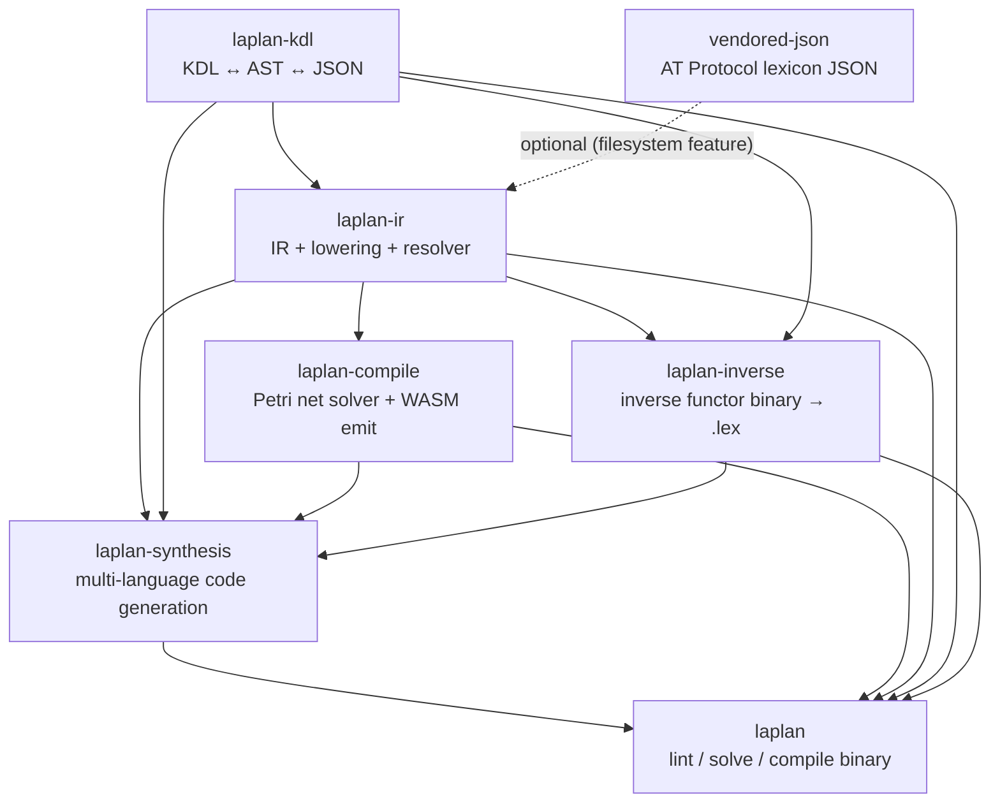
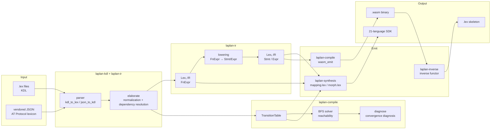

# Architecture Overview

laplan is a compiler infrastructure that parses types and morphisms declared in `.lex` (a KDL dialect), solves Petri net reachability problems, and generates SDKs and WASM binaries.

## Crate Dependency Graph

Dependencies are unidirectional with no cycles. `cli` is a thin orchestration layer over all crates; implementation lives in `ir`, `compile`, `synthesis`, and `inverse`.

## Pipeline

Full flow from `.lex` to WASM and multi-language SDKs.

### Stage Responsibilities

| Stage | Crate | Input | Output |
|---|---|---|---|
| Parse | `laplan-kdl` | `.lex`, `.json` | Raw AST (KDL node sequence) |
| Elaborate | `laplan-ir` | Raw AST | Normalized IR (`RuleBundle`, `Lexicon`, `Mapping`) |
| Lower | `laplan-ir` | Lex₁ `FnExpr` | Lex₂ `Stmt` / `Expr` |
| Solve | `laplan-compile` | `RuleBundle` + marking | Reachable paths / diagnostics |
| Synthesize | `laplan-synthesis` | IR + mapping | 21-language SDK |
| Compile | `laplan-compile` | Lex₂ IR | WASM binary |
| Invert | `laplan-inverse` | WASM binary | `.lex` skeleton |

## Two-Layer Solver

The laplan solver is intentionally designed as a **two-layer architecture**.

| Layer | Target | Search granularity | Location |
|---|---|---|---|
| Layer 1: morphism solver | Lex₁ morphisms (rule, const, assign, chain) | Composition paths at endpoint granularity | `compiler/compile/src/solver.rs` |
| Layer 2: instruction solver | Lex₂ structural constraints (func, family, law) | Pruning, identification, and derivation basis | `compiler/compile/src/diagnose.rs`, `axiom_table.rs` |

The **solver boundary** between Lex₁ and Lex₂ is the key to convergence. The solver explores only Lex₁ and uses Lex₂ as judgment material, keeping state space explosion under control. For layer classification details, see [reference/layers.md](../reference/layers.md).

## Connection to External Projects

laplan is designed as a general-purpose compiler infrastructure. Downstream projects such as AT Protocol implementations (neco-atproto) consume synthesis output and add domain-specific logic.

- laplan uses foundational crates such as KDL, JSON, and SHA2 as dependencies.
- `vendored-json/` bundles the official AT Protocol lexicon JSON (enabled via the `filesystem` feature).

For synthesis extension points, see [architecture/synthesis.md](synthesis.md). For the solver, see [architecture/solver.md](solver.md).
