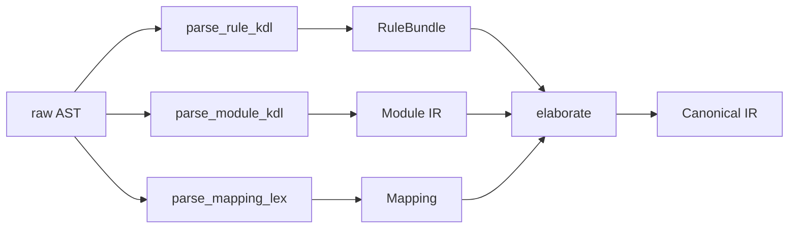

# Parser

This stage converts `.lex` (a KDL dialect) and AT Protocol lexicon JSON into normalized IR. It is split across two crates: `laplan-kdl` and `laplan-ir`.

## Responsibility Split

| Crate | Responsibility | Files |
|---|---|---|
| `laplan-kdl` | Bidirectional conversion between KDL, AST, and Lexicon JSON. Syntax layer. | `kdl_to_lex.rs`, `lex_to_kdl.rs`, `kdl_to_json.rs`, `json_to_kdl.rs`, `axiom.rs` |
| `laplan-ir` | AST → IR elaboration. Declaration normalization, dependency resolution, NSID resolution. | `rule.rs`, `module.rs`, `const_decl.rs`, `chain.rs`, `refinement.rs`, `family.rs`, `fn_expr.rs`, `stmt_expr.rs`, `mapping.rs` |

## laplan-kdl Public API

```
pub fn kdl_to_lexicon_json(kdl: &str) -> Result<String, ConvertError>
pub fn lexicon_json_to_kdl(json: &str) -> Result<String, ConvertError>
pub fn lexicon_kdl_to_lex(kdl: &str) -> Result<String, ConvertError>
pub fn lex_to_lexicon_kdl(lex: &str) -> Result<String, ConvertError>
pub fn axiom_kdl_to_json(kdl: &str) -> Result<String, ConvertError>
pub fn delta_kdl_to_json(kdl: &str) -> Result<String, ConvertError>
pub fn serialize_document(doc: &neco_kdl::KdlDocument) -> String
```

- `lexicon_kdl_to_lex` / `lex_to_lexicon_kdl`: bidirectional conversion between AT Protocol lexicon and the `.lex` dialect.
- `axiom_kdl_to_json`, `delta_kdl_to_json`: convert axiom and delta (refinement) specific blocks to JSON.

## .lex Syntax Extensions

`.lex` is KDL-based with the following additions. For layer classification details, see [reference/layers.md](../reference/layers.md).

```kdl
// Lex₀: lexicon
lexicon "com.example.foo" version=1 {
    parameters { handle { type=string } }
    output { did { type=string } }
}

// Lex₁: rule / const / assign / chain / refinement
rule "resolve-handle" {
    requires { input { handle } }
    produces { output { did } }
}

const "epoch" { type=i64; value=0 }

morph.chain "register" {
    step "validate-handle"
    step "issue-did"
}

// Lex₂: func / family / law / dual / invariant
func.law "i32.add.comm" {
    forall { a { type=i32 }; b { type=i32 } }
    equation "add(a, b) == add(b, a)"
}

func.family "Complex" {
    product "f32" 2
}

// Lex₃: cratis / import
cratis "my-app" version=1 {
    provides { endpoint "com.example.foo" }
    requires { axiom "i32.add" }
}
```

## KDL → AST Conversion Rules

`kdl_to_lex.rs` in `laplan-kdl` expands KDL-specific notation into AST fields.

| KDL notation | Converted to |
|---|---|
| `node "name" attr=value { ... }` | AST node (name + properties + children) |
| `(type)value` | Type-annotated literal |
| `#true` / `#false` / `#null` | bool / null |
| Raw string notation `#"..."#` | Kept as-is |

Special prefix handling:
- `morph.*` / `rule.*` / `func.*` / `pkg.*` are stripped as layer classification prefixes at the top level.
- Shorthand forms (`rule`, `chain`, `mapping`, `family`, `law`, `cratis`, `import`, etc.) are expanded to their prefixed equivalents.

## laplan-ir Elaboration

Traverses the AST and performs the following:



| Function | Role |
|---|---|
| `parse_rule_kdl` | AST for rule / const / assign / handler / chain / refinement / derives → `RuleBundle` |
| `parse_lib_lex` | Normalize cratis / face / member declarations into `LibConfig` |
| `parse_family_lex` | Expand family declarations into `FamilyTable` (including product expansion) |
| `parse_build_lex` | Build configuration (`EmitTarget`, `BoundaryRule`) |
| `parse_const_decl_kdl` / `AssignDecl` | const / assign declarations |
| `parse_wasm_mapping_kdl` | WASM opcode mapping |
| `parse_resolver_lex` | resolver.lex (KDL) → `Vec<FnDef>` (Lex₁ FnExpr). See the "resolver.lex" section in [ir.md](ir.md) |
| `elaborate` | Cross-declaration normalization of type connections and dependencies |
| `rule_bundle_to_canonical` | Convert to AT Protocol-compatible canonical form |

## NSID Resolution

`nsid_resolver.rs` handles bidirectional resolution between file paths (`axiom/i32/add.lex`) and NSIDs (`i32.add`).

- `NsidResolver::from_workspace()` determines the axiom root via `ir::paths::axiom_dir()`.
- Language templates: `compiler/synthesis/builtin/target.lang/`
- Bind templates: `compiler/synthesis/builtin/target.bind/`
- Binary templates: `compiler/compile/builtin/target.binary/`

## Connection to vendored-json

The `vendored-json/` crate (`atproto-lexicon-vendored`) bundles the official AT Protocol lexicon JSON. It is pulled in by `laplan-ir`'s `filesystem` feature (enabled by default) and is available via `load_bundled_manifest()`.

For environments without filesystem access, such as WASM builds, use `--no-default-features` to decouple it; the caller then constructs the `TransitionTable` directly.

## Generated Output Headers

Synthesis output and inverse output each receive a dedicated license header.

```rust
pub const SYNTHESIZED_HEADER: &str;   // attached to synthesis output
pub const INVERSE_HEADER: &str;       // attached to .lex files produced by inverse
pub fn rewrite_header_prefix(header: &str, prefix: &str) -> String;
```

`rewrite_header_prefix` rewrites the header to use the per-language comment prefix (`//`, `--`, `#`, `%%`).
