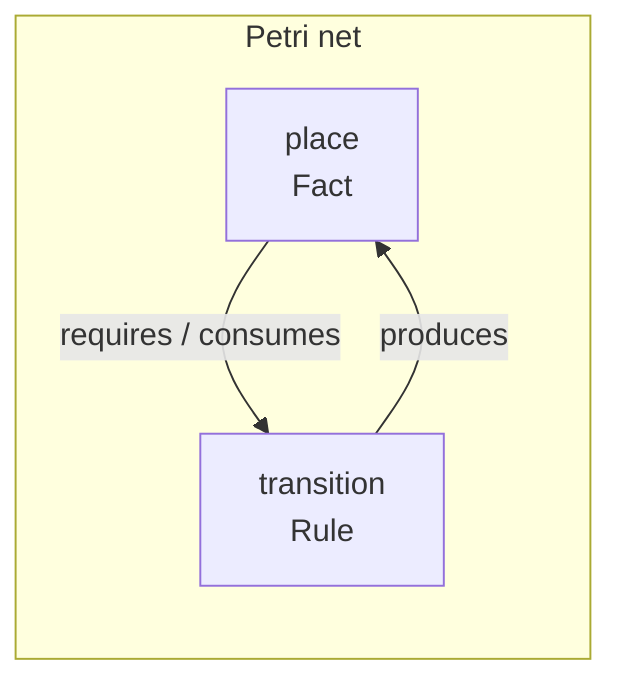
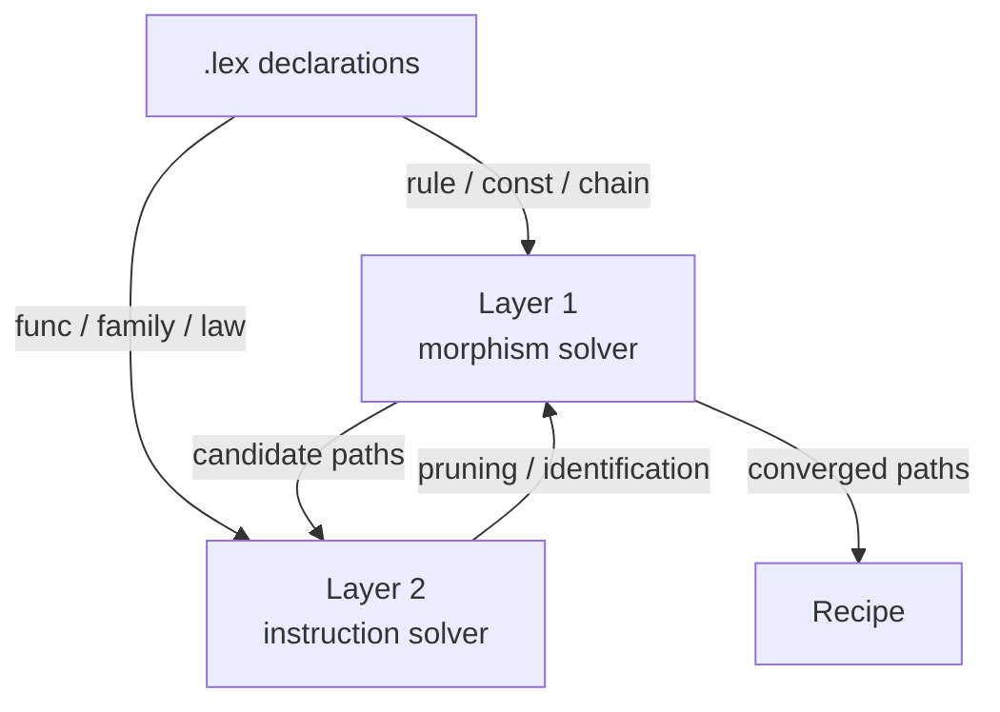
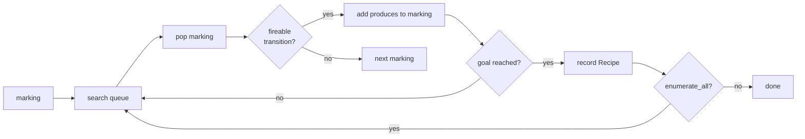

# Petri Net Solver

The laplan solver treats the requires/produces network of rules declared in `.lex` as a Petri net and enumerates paths from a marking to a goal via BFS.

## What the Solver Solves

The solver models the world with three concepts.

| Concept | Meaning | Corresponding `.lex` declaration |
|---|---|---|
| Place | A kind of "thing held" | fact (`output`, `capability`, `input`, etc.) |
| Transition | "Something that can be done" | rule, const, assign, chain |
| Marking | The set of "things currently held" | Current set of facts |

A marking is a snapshot of what is currently held. A rule declares what must be held to fire it (requires) and what firing it produces (produces).



The question the solver answers: "Starting from the initial marking, can we reach a state that contains the set of facts specified by the goal? If so, which rules must be fired and in what order?"

```
Initial marking: { input("handle") }
Goal:            { output("profile") }

Search result:
  input("handle") → [resolve_handle] → output("did")
                   → [get_profile]   → output("profile")
```

When the goal is unreachable, the solver reports missing facts. When multiple paths are found, all are enumerated with the shortest path prioritized.

### 1-Safe Semantics

laplan markings are binary per fact: either present or absent (1-safe Petri net). A fact cannot be held more than once. This constraint keeps the search space finite, and combined with the `max_depth` limit, the solver always terminates.

## Implementation Details

### Fact Kinds

| Concept | Corresponding type | Corresponding `.lex` declaration |
|---|---|---|
| place | `Fact` | `lexicon` output / input / capability, etc. |
| transition | `Transition` | `rule`, `const`, `assign`, `chain`. Standalone rules not tied to an endpoint are added via `add_standalone_rules`. |
| token | Instance of `Fact` | Element of a marking |
| marking | `Marking = BTreeSet<Fact>` | Current solver state |
| goal | `Goal = Vec<Fact>` | Endpoint / free specification |
| firing | `Recipe` | One step in a reachable path |

```rust
pub enum Fact {
    Capability(String),
    CapabilityExpired(String),
    Output(String),
    SelfKey(String),
    Input(String),
    Selected(String),
}
```

The CLI format `goal <kind>:<value>` maps to these enum variants.

## Two-Layer Solver

The laplan solver is a **two-layer architecture** that handles Lex₁ morphisms and Lex₂ structural constraints in separate layers.



| Layer | Target | Data | File |
|---|---|---|---|
| Layer 1: morphism solver | Lex₁ morphisms (rule, const, assign, chain) | `Transition`, `Fact`, `Marking` | `solver.rs`, `axiom_table.rs`, `fact.rs` |
| Layer 2: instruction solver | Lex₂ instruction-level equivalence | `InstructionTransition`, `InstructionFact`, `InstructionMarking` | `solver.rs` (same file), `diagnose.rs`, `assessment.rs` |

The `SearchTransitionLike` trait unifies both layers so the same BFS core operates on both `Fact` and `InstructionFact`.

`InstructionFact` has two variants, `Value { ty, name }` and `SimdValue { ty, name, lanes }`, used for equivalence judgment in SIMD optimization and parallelization.

## BFS Search



### SearchConfig

```rust
pub struct SearchConfig {
    pub allow_duplicate_steps: bool,
    pub enumerate_all: bool,
}

pub enum SolveMode { Execute, DryRun }
```

| Field | Effect |
|---|---|
| `allow_duplicate_steps` | Allows the same transition to fire multiple times (for instruction level) |
| `enumerate_all` | Enumerates all paths up to `max_depth` instead of stopping at the shortest |

`SearchConfig::instruction_level()` is a preset that enables both.

### Key APIs

```rust
// compile/api.rs
pub fn solve(marking: Marking, goal_spec: &str, table: &TransitionTable) -> SolveOutput;
pub fn solve_module_endpoint(...) -> SolveOutput;
pub fn marking_from_json(marking: &HashMap<String, String>) -> Marking;

// TransitionTable methods (diagnose.rs)
impl TransitionTable {
    pub fn search(&self, marking: Marking, goal: &[Fact], max_depth: usize) -> Vec<Recipe>;
    pub fn search_all(&self, marking: Marking, goal: &[Fact], max_depth: usize) -> Vec<Recipe>;
    pub fn search_dry_run(&self, marking: Marking, goal: &[Fact], max_depth: usize) -> Vec<Recipe>;
    pub fn diagnose(&self) -> Vec<NeedsDiagnostic>;
    pub fn diagnose_convergent_paths(&self, max_depth: usize) -> Vec<NeedsDiagnostic>;
    pub fn diagnose_goal(&self, goal: &[Fact]) -> Vec<GoalDiagnostic>;
    pub fn diagnose_laws(/* ... */);
    pub fn add_standalone_rules(&mut self, rules: &[Rule]);
}
```

`search` returns the shortest path. `search_all` returns all paths up to `max_depth`. `search_dry_run` confirms paths only, without side effects.

## SolveOutput

```rust
pub enum SolveOutput {
    Ok(Vec<Recipe>),
    AlreadySatisfied,
    PreflightRequired { recipe, axiom_nsids },
    AmbiguousAxiomCrossing { candidates, axiom_nsids },
    NeedsUserAction(Vec<Fact>),
    Boundary(BoundaryKind),
    InvalidGoalSpec { goal_spec },
}
```

| Variant | Meaning |
|---|---|
| `Ok` | Path found |
| `AlreadySatisfied` | Marking already satisfies the goal |
| `PreflightRequired` | Preflight required to cross an axiom boundary |
| `AmbiguousAxiomCrossing` | Multiple candidates, cannot determine uniquely |
| `NeedsUserAction` | User input (input / selected) is missing |
| `Boundary` | Request crosses a client / server boundary |
| `InvalidGoalSpec` | Syntax error in goal specification |

## Pruning

Lex₂ structural constraints narrow the Lex₁ space the solver explores.

| Constraint | Effect |
|---|---|
| `inverse` | Omits one of a pair of paths with inverse morphisms |
| `func.law` | Identifies equivalent paths. Symmetry reduction via algebraic laws. |
| `func.family` | Consolidates duplicate paths by expanding product / vectorize components |
| `boundary` | Splits the search space by client / server separation |
| `invariant` | Eliminates violating paths via invariants such as count consistency |

## Diagnostics (Layer 2)

`diagnose.rs` owns Layer 2 structural checks.

| Diagnostic | Meaning |
|---|---|
| `MissingProduces` | No rule exists that produces the endpoint's output |
| `ConvergentPaths` | Multiple paths reach the same goal at different depths |
| `DeadBridge` | Prerequisite fact for a bridge rule is missing |
| `SubtypeCycle` | Cycle in subtype relationships |
| `TimedCapabilityNoRenewal` | TTL-bearing capability has no renewal path |
| `LawTargetNotFound` | Target rule referenced by a law is undefined |

`diagnose_convergent_paths` is computationally expensive and is called separately from `diagnose`.

## Layer 0 Lint

`lint.rs` checks only the well-formedness of `.lex` declarations without constructing a Petri net.

| Kind | Detected |
|---|---|
| `OrphanOutput` | Output not connected to the input of any other endpoint |
| `UnsatisfiedInput` | No endpoint holds an output matching the input |
| `TypeConnection` | Type connection via matching field names (informational) |

Run from the CLI with `laplan lint <dir>`. See [architecture/cli.md](cli.md) for details.

## Parallel DAG

`concurrency.rs` analyzes dependencies between transitions and constructs a DAG for parallel execution.

```rust
pub fn build_parallel_dag(transitions: &[Transition]) -> ParallelDag;
pub fn are_independent(a: &Transition, b: &Transition) -> bool;
pub fn has_dependency(a: &Transition, b: &Transition) -> bool;
```

`bake --parallel` embeds the parallel DAG into WASM. See [architecture/compiler.md](compiler.md) for details.

## TransitionTable Construction

| Method | File | Feature |
|---|---|---|
| `bundled_table()` | `bundle.rs` | `bundle` (default) |
| Manual construction | `morphisms_to_transitions` (`axiom_table.rs`) | Always available |

When the `bundle` feature is disabled (e.g., WASM builds), the caller assembles the `TransitionTable` via `morphisms_to_transitions`.

---

## Formal Definition

This section formalizes the solver's behavior mathematically.

### Petri Net Definition

A Petri net is defined as a 4-tuple $N = (P, T, F, W)$.

- $P$: finite set of places
- $T$: finite set of transitions ($P \cap T = \emptyset$)
- $F \subseteq (P \times T) \cup (T \times P)$: flow relation
- $W: F \to \mathbb{N}^{+}$: arc weights

A marking $M: P \to \mathbb{N}$ gives the token count for each place.

### Firing Rule

Transition $t$ is enabled when the following holds.

$$
\forall p \in {}^\bullet t : M(p) \geq W(p, t)
$$

Marking $M'$ after firing:

$$
M'(p) = M(p) - W(p, t) + W(t, p)
$$

Since laplan is 1-safe ($M: P \to \{0, 1\}$, $W = 1$), this simplifies to:

$$
t \text{ enabled at } M \iff \text{requires}(t) \subseteq M
$$

$$
M' = (M \setminus \text{consumes}(t)) \cup \text{produces}(t)
$$

When `consumes` is empty, the marking grows monotonically. When `consumes` is non-empty, tokens are removed, expressing behaviors such as the expiration of a TTL-bearing capability.

### Reachability Problem

Given initial marking $M_0$ and goal $M_g$, find a firing sequence $t_1, t_2, \ldots, t_n$ satisfying:

$$
M_0 \xrightarrow{t_1} M_1 \xrightarrow{t_2} \cdots \xrightarrow{t_n} M_n \supseteq M_g
$$

The goal is given not as a marking itself but as a set of facts that $M_n$ must contain.

### Decidability

Reachability in 1-safe Petri nets is EXPSPACE-complete. laplan keeps this tractable via the following constraints:

1. Search is cut off at `max_depth`.
2. State space is reduced by Lex₂ constraint-based pruning.
3. The problem is decomposed by per-endpoint goal splitting.

### Lean Formal Verification

The following properties of solver soundness are proved in Lean 4:

- Paths are constructive proofs of reachability.
- Adding constraints (law, invariant) subdivides the equivalence classes of reachability.
- Annotations (capability, ownership) are not recoverable from types alone.

### References

- Murata, T. "Petri Nets: Properties, Analysis and Applications", Proc. IEEE, 1989
