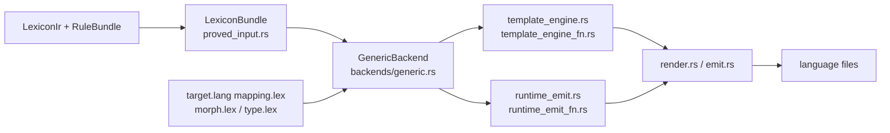

# Multi-Language Synthesis

`laplan-synthesis` is the back half of the compiler, generating SDKs for 21 languages and WASM bindings from IR. Per-language differences are managed in declarative templates under `axiom/target/lang/{lang}/`, and the Rust side drives them uniformly through `GenericBackend`.

## Pipeline



### Input Builders

- `load_proved_bundle_from_path` / `load_proved_bundle_from_json` (`proved_input.rs`): construct a `LexiconBundle` from a proved input JSON.
- `build_lexicon_bundle`: construct a `LexiconBundle` directly from IR.

### Output Entry Points

- `render_neutral_module` / `render_full_module_for_target`: emit both target-independent IR and per-language artifacts.
- `write_rendered_module_artifacts`: write to disk.
- `generate_recipe_manifest` / `write_rust_mod_tree`: module tree and manifest.
- `export_lean_from_ir`: Lean formal verification input.

## GenericBackend

`GenericBackend` in `backends/generic.rs` loads mapping.lex / morph.lex / type.lex and holds the templates for language output.

```rust
pub struct GenericBackend { /* mapping, type_map, morph_overrides, ... */ }

pub fn all_mapping_names() -> &'static [&'static str];   // list of supported languages
pub fn generic_backend_for_target(target: &str) -> Option<GenericBackend>;
pub fn cached_mapping(target: &str) -> &'static Mapping;
pub fn profile_for(target: &str) -> LanguageProfile;
pub fn render_stub(target: &str, ...) -> String;
```

Per-language `GenericBackend` instances are called from `render.rs` and `runtime_emit.rs`, filling in template strings as a formatter.

## Role of axiom/target/lang

```
axiom/target/lang/{lang}/
├── mapping.lex    # type, syntax, control, and handler templates
├── morph.lex      # morphism (axiom call) implementation patterns
├── type.lex       # additional type declarations
└── cli templates are placed in the `cli { ... }` section of `mapping.lex`
```

### mapping.lex Sections

| Section | Role |
|---|---|
| `extension` | Output file extension (`"rs"`, `"ts"`, ...) |
| `keywords strict` | Reserved words. Used for identifier conflict checks. |
| `keywords builtins` | Language built-in types |
| `file-collisions` | Reserved file names |
| `identifier-escape` | Escape on conflict (`prefix="r#"`, etc.) |
| `syntax { product, sum, alias }` | Type declaration templates |
| `control { if, for, fn, module }` | Control flow syntax |
| `variable { binding, mutable-binding, assign, return }` | Bindings and assignment |
| `functional { let-in, match, ... }` | Lex₁ path (functional languages only) |
| `handler` | Endpoint handler trait |
| `bindings` | External library mappings |
| `stub-template` | Stub code |
| `lowering` | Lowering templates for `fst` / `snd` / `from-maybe`, etc. |

### Template Variables

Variables available in mapping.lex string templates:

| Variable | Meaning |
|---|---|
| `{gen}` | Basename of `generated-subdir` (e.g., `synth`) |
| `{Gen}` | `{gen}` with initial uppercase (e.g., `Synth`). For PascalCase languages like Elixir. |
| `{name}`, `{Name}`, `{NAME}` | Lowercase / PascalCase / uppercase |
| `{type}`, `{return_type}`, `{params}` | Type and signature |
| `{cond}`, `{var}`, `{collection}` | Control flow substitutions |

`Mapping::expand_gen_placeholder` (`ir/mapping.rs`) expands `{gen}` / `{Gen}` to actual values.

## Lex₁ Path vs Lex₂ Path

| Path | Target languages | IR | Generator |
|---|---|---|---|
| Lex₁ | Haskell, OCaml, Gleam, Elixir | `FnExpr` | `axiom/resolver.lex` → `parse_resolver_lex`, `template_engine_fn.rs`, `runtime_emit_fn.rs` |
| Lex₂ | Remaining 17 languages + WASM | `Stmt` / `Expr` | `lowering.rs` (automatic Lex₁→Lex₂ lowering), `template_engine.rs`, `runtime_emit.rs` |

`has_functional_templates()` branches automatically based on whether a `functional {}` section exists in mapping.lex.

The Lex₂ path is composed entirely of automatic lowering. The 7 resolver functions are defined in `axiom/resolver.lex` (KDL). See the "resolver.lex" section in [architecture/ir.md](ir.md).

### Runtime Dispatch Field Names

The struct field names in `MappingRuntime` and the key names in mapping.lex follow the `runtime_solve_*` convention (`runtime_solve_header`, `runtime_solve_module_name`, `runtime_solve_filename`). The generated output filename and function name inside the output use `resolve`. This naming inconsistency is a known specification; use the `runtime_solve_*` key names when editing mapping.lex.

## Supported Language Table

Supported 21 languages: `clojure`, `cpp`, `csharp`, `d`, `dart`, `elixir`, `gleam`, `go`, `haskell`, `java`, `javascript`, `kotlin`, `lua`, `ocaml`, `php`, `python`, `ruby`, `rust`, `swift`, `typescript`, `zig`.

| Capability Level | Coverage |
|---|---|
| L1 type | Type declarations only (product, sum, alias) |
| L2 interface | Handler trait + effect type generation |
| L3 recipe | Recipe manifest + dispatch |
| L4 solver | Goal synthesis execution |

Per-language capability levels are listed in [reference/target-languages.md](../reference/target-languages.md).

## Binding Layer

`bind_typescript.rs`, `bind_python.rs`, and `bind_server.rs` (behind the `atproto-server` feature gate) generate language bindings for WASM.

```rust
pub fn generate_typescript_bindings(...) -> TypeScriptBindings;
pub fn generate_python_bindings(...) -> PythonBindings;
#[cfg(feature = "atproto-server")]
pub fn generate_server_bindings(...) -> ServerBindings;
```

Templates for bind target languages live under `axiom/target/bind/{lang}/` and are driven by `bind_mapping.rs`.

## Feature Gate: atproto-server

The `atproto-server` feature (enabled by default) isolates AT Protocol server-specific generation.

| Module | Contents |
|---|---|
| `server_output.rs` | Server implementation (routes, handlers, bridge traits, chain impls, probe impls) |
| `execution.rs` | ExecutionNode, ProofWitness |
| `bind_server.rs` | Server bindings |
| `package_audit.rs` | Published package audit |

`--no-default-features` enables emit-only builds.

## Lean Export

`export_lean_from_ir` in `lean_export.rs` converts lexicon IR into Lean 4 `LexiconCode`. This is the connection point with Lean formal verification projects.

## Additional Emit

| Feature | File |
|---|---|
| WGSL (WebGPU shader) | `wgsl_emit.rs` |
| WASM direct emit | `wasm_emit.rs`, `wasm_lower.rs` |
| Rust-specific utilities | `rust/` |
| Legacy per-language helpers | `lang/` |
