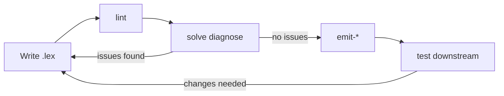

# Getting Started

This page covers building laplan, writing your first `.lex` declaration, and the basic lint / solve / synthesis workflow.

## Build

```bash
git clone <laplan-repo>
cd laplan
cargo build --release
```

The `laplan` binary is distributed from `compiler/cli`.

```bash
cargo run -p laplan-cli -- --help
cargo run -p laplan-cli -- lint lexicon
```

During development, use `cargo run -p laplan-cli -- <command>`.

### Check targets

```bash
cargo check -p laplan-ir -p laplan-synthesis -p laplan-cli     # basic check
cargo check -p laplan-synthesis --no-default-features          # emit-only build
cargo check -p laplan-ir --no-default-features                 # WASM-targeted ir
cargo test -p laplan-synthesis --lib runtime_emit              # Lex₂ regression
cargo test -p laplan-synthesis --lib runtime_program_fn        # Lex₁ regression
```

## First `.lex`

Create a directory under `axiom/`, then write a `rule.lex` and a `lexicon`.

### lexicon definition

```kdl
// lexicon/sample/get-user.lex
lexicon "sample.get-user" version=1 {
    query {
        params { handle { type=string; required=#true } }
        output { did { type=string } }
    }
}
```

### rule definition

```kdl
// lexicon/sample/rule.lex
rule "resolve-handle" {
    requires { input { handle } }
    produces { output { did } }
}
```

## lint

```bash
cargo run -p laplan-cli -- lint lexicon/sample
```

Layer 0 static analysis reports OrphanOutput, UnsatisfiedInput, and TypeConnection issues. See [architecture/cli.md](../architecture/cli.md) for details.

## solve

### Structural diagnosis

```bash
cargo run -p laplan-cli -- solve diagnose lexicon/sample --max-depth 8
```

Reports structural problems (MissingProduces, DeadBridge, SubtypeCycle, ConvergentPaths, etc.) for all endpoints.

### Path enumeration

```bash
cargo run -p laplan-cli -- solve paths lexicon/sample sample.get-user
```

Displays reachable paths by depth for each endpoint.

### Reachable set

```bash
cargo run -p laplan-cli -- solve reachable lexicon/sample --from '{"handle":""}'
```

Enumerates all facts reachable from a marking, with depth.

### Free goal

```bash
cargo run -p laplan-cli -- solve goal lexicon/sample "output:did" --from '{"handle":""}'
```

Searches paths by goal specification, not bound to any endpoint.

## synthesis

synthesis operates per cratis. Declare a cratis first.

```kdl
// lexicon/sample/cratis.lex
cratis "sample" version=1 {
    provides { endpoint "sample.get-user" }
}
```

See [guide/cratis.md](cratis.md) for how to write a cratis.

### Multi-language SDK generation

Use the `generate` subcommand from the CLI. Specify the language with `--target`.

```bash
cargo run -p laplan-cli -- generate --lexicon-dir lexicon/sample --output out/rust/ --target rust
cargo run -p laplan-cli -- generate --lexicon-dir lexicon/sample --output out/ts/ --target typescript
```

Omitting `--target` emits all 21 languages at once. See [reference/target-languages.md](../reference/target-languages.md) for the full language list and [architecture/cli.md](../architecture/cli.md) for subcommand details.

### WASM bake

```bash
cargo run -p laplan-cli -- emit-wasm --bake \
    --module-dir lexicon/sample \
    --output out/sample.wasm
```

Additional flags:

- `--simd`: SIMD optimization
- `--parallel`: parallel DAG embedding
- `--constant-time`: constant-time execution
- `--bind typescript --bind-output out/bind/`: TypeScript bindings
- `--server-output out/server/`: server implementation stub

See [architecture/compiler.md](../architecture/compiler.md) for details.

## VSCode Extension

An extension in `extension/` provides syntax highlighting, inlay hints, and Petri net visualization for `.lex` files. Build and installation steps are in [guide/wasm-extension.md](wasm-extension.md).

## Typical Workflow



1. Write `.lex`
2. Eliminate static errors with `lint`
3. Verify paths and structural constraints with `solve diagnose`
4. Generate SDK / WASM with `emit-*`
5. Consume in downstream projects (neco-atproto, etc.)
6. Return to `.lex` and fix if problems arise

Layer classification and criteria are in [reference/layers.md](../reference/layers.md). The solver internals are in [architecture/solver.md](../architecture/solver.md).
