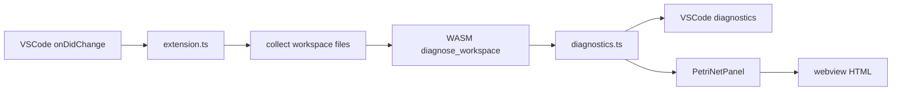

# VSCode Extension and WASM

`extension/` contains a VSCode extension that provides syntax highlighting, diagnostics, semantic tokens, inlay hints, and a Petri net webview for `.lex` files. The core is compiled to WASM and calls into `compiler/ir`, `compile`, and `synthesis`.

## Build

```bash
cd extension
npm install
npm run build:wasm    # wasm-pack build
npm run compile       # tsc
npm run package       # wasm + tsc + vsix
```

Artifacts:

- `extension/wasm-pkg/`: `wasm-pack` output (gitignored)
- `extension/laplan-lex-<version>.vsix`: distributable package

## Structure

```
extension/
├── src/
│   ├── extension.ts            # entry point
│   ├── diagnostics.ts          # WASM results → VSCode diagnostics
│   ├── graph/
│   │   ├── types.ts            # rendering-agnostic graph model
│   │   └── petriNetPanel.ts    # WebviewPanel management
│   └── webview/
│       ├── renderer.ts         # Renderer interface
│       └── cytoscapeRenderer.ts
├── wasm/
│   └── src/lib.rs              # WASM API
├── syntaxes/                   # TextMate grammar
└── language-configuration.json
```

### WASM API

`extension/wasm/src/lib.rs` is the WASM export surface.

```rust
#[wasm_bindgen]
pub fn diagnose_workspace(files: &JsValue) -> JsValue;
```

Return type:

```ts
type WorkspaceReport = {
    diagnostics: Diagnostic[];
    lints: Lint[];
    connections: Connection[];
    graph: {
        transitions: GraphTransition[];
        parallel_dag: ParallelDagData;
        subtypes: Subtype[];
        cratis: CratisEntry[];
    };
};
```

The extension links `laplan-ir`, `laplan-compile`, and `laplan-synthesis` under `--no-default-features`. Filesystem-dependent features belong to the extension. Workspace file contents are passed from the JS side.

### TypeScript flow



### Petri net webview

- `graph/types.ts`: rendering-library-agnostic data model (`PetriNetGraph`, `GraphTransition`, ...)
- `graph/petriNetPanel.ts`: WebviewPanel management. Cytoscape.js is bundled. Protected by CSP nonce.
- `webview/renderer.ts`, `cytoscapeRenderer.ts`: Renderer interface and reference implementation
- Actual rendering is handled by inline JS inside `petriNetPanel.ts`

### Swapping in WebGPU

`webview/renderer.ts` defines a Renderer interface. The Cytoscape implementation is one concrete instance. The structure supports substituting a WebGPU Renderer.

## Features

| Feature | Implementation |
|---|---|
| Syntax highlighting | `syntaxes/` (TextMate) |
| Diagnostics | `diagnose_workspace` → VSCode Diagnostic Provider |
| Semantic tokens | Via WASM API |
| Inlay hints | Type annotations inserted via WASM API |
| Petri net visualization | `PetriNetPanel` + Cytoscape |
| Commands: `laplan.showGraph`, etc. | `extension.ts` |

## Installing the `.vsix`

```
code --install-extension extension/laplan-lex-0.2.0.vsix
```

The version is in sync with `version` in `package.json`.

## Troubleshooting

| Symptom | Fix |
|---|---|
| `wasm-pkg` is missing | Run `npm run build:wasm` |
| Extension does not load | Reinstall the `.vsix` and restart VSCode |
| Diagnostics do not update | Run `Developer: Reload Window` in VSCode |
| Petri net does not display | Check the webview console via `Help > Toggle Developer Tools` |

## Related

- [architecture/solver.md](../architecture/solver.md): internals of diagnose and lint
- [architecture/synthesis.md](../architecture/synthesis.md): WASM binding generation
