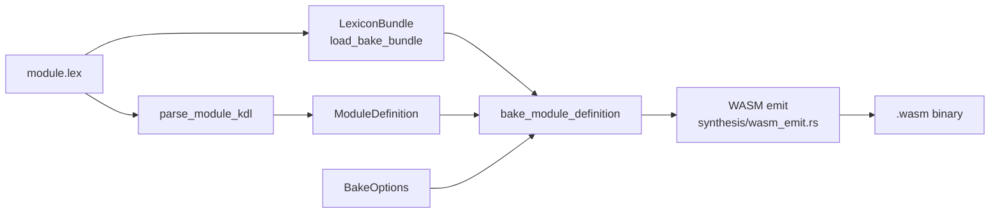

# コンパイラ

`laplan-compile` は Petri net solver と WASM バイナリ emit を担い、`laplan-inverse` は逆関手を提供します。逆関手は型宣言レベルでは全言語対応、関数/trait 抽出は Rust 固有、WASM は独立経路という 3 層構造で、詳細は本ページ後半を参照。

## laplan-compile の構成

```
compiler/compile/src/
├── api.rs              # solve, marking_from_json, SolveOutput
├── assessment.rs       # NeedAssessment, BoundaryKind
├── axiom_table.rs      # TransitionTable, Recipe, morphisms_to_transitions
├── bundle.rs           # #[cfg(feature = "bundle")] 組み込み TransitionTable
├── concurrency.rs      # ParallelDag, are_independent, has_dependency
├── convert.rs          # 型変換ヘルパ
├── diagnose.rs         # 収束診断、Dead/Orphan 検出
├── fact.rs             # Fact, Goal, Marking, InstructionFact
├── lint.rs             # Layer 0 静的検査
└── solver.rs           # BFS 本体、SearchConfig, SolveMode
```

### 公開 API の主要型

```rust
pub enum SolveOutput {
    Ok(Vec<Recipe>),
    AlreadySatisfied,
    PreflightRequired { recipe: Recipe, axiom_nsids: Vec<String> },
    AmbiguousAxiomCrossing { candidates: Vec<Recipe>, axiom_nsids: Vec<String> },
    NeedsUserAction(Vec<Fact>),
    Boundary(BoundaryKind),
    InvalidGoalSpec { goal_spec: String },
}

pub struct SearchConfig {
    pub allow_duplicate_steps: bool,
    pub enumerate_all: bool,
}

pub enum SolveMode { Execute, DryRun }
```

solver の詳細は [architecture/solver.md](solver.md) 。

### feature gate

| feature | 有効化される機能 |
|---|---|
| `bundle` (default) | `bundled_table()` による vendored-json からの `TransitionTable` 構築 |

`--no-default-features` で WASM ビルド可能にし、呼び出し側が `TransitionTable` を構築する構成も取れます。

## WASM バイナリ生成パイプライン

`synthesis/src/bake.rs` が `laplan-compile` と協調して WASM モジュールを組み立てます。



### BakeOptions

```rust
pub struct BakeOptions {
    pub simd: bool,              // --simd: SIMD 最適化
    pub parallel: bool,          // --parallel: 並列実行 DAG の組込
    pub parallel_target: VectorizeTarget,
    pub constant_time: bool,     // --constant-time: timing 攻撃耐性
}
```

CLI フラグとの対応:

| フラグ | 意味 | 前提 |
|---|---|---|
| `--bake` | モジュールを WASM に焼き込む | `emit-wasm` サブコマンド |
| `--simd` | `v128` ベクトル演算で書き換え | `--bake` |
| `--parallel` | `ParallelDag` を組み込み並列化 | `--bake` |
| `--constant-time` | 分岐と table lookup を回避 | `--bake` |
| `--bind <typescript\|python>` | WASM に対する言語バインディングを生成 | `--bake` |
| `--server-output` | サーバ実装 stub を生成 | `--bake` |

### WASM emit 層

`synthesis/src/wasm_emit.rs` と `wasm_lower.rs` が Lex₂ IR (`Stmt` / `Expr`) を WASM バイトコードに変換します。

| 型 | 役割 |
|---|---|
| `WasmValType` (`I32`/`I64`/`F32`/`F64`/`V128`) | 値型 |
| `WasmFuncType` | 関数シグネチャ (params + results + locals) |
| `WasmImport` / `WasmExport` | import / export エントリ |
| `WasmModule` | 完成した WASM モジュール |

`wasm_bindgen_output.rs` が TypeScript / Python バインディングを生成します。

## derives 展開

`axiom/` の rule に書かれた `derives { vectorize f32 4; ... }` のような宣言は、`synthesis/src/derives_resolve.rs` で具体的な transition に展開されます。

| derive | 効果 |
|---|---|
| `vectorize <type> <count>` | 要素単位の axiom から SIMD / 並列版を自動導出 |
| `family.product` | 成分単位演算を family メンバから導出 |
| `lift` / `compose` | 圏論プリミティブによる合成 |

展開結果は `TransitionTable` に追加され、solver が経路として選択可能になります。

## laplan-inverse: 逆関手

逆関手は「生成コード → `.lex` スケルトン」を取り出し、往復変換 (roundtrip) で設計の妥当性を検証します。現状は 3 層構造で、対応範囲が層ごとに異なります。

```
compiler/inverse/src/
├── extract.rs           # Rust ソースの pub API 抽出 (syn, Rust 固有)
├── convert.rs           # PublicApi → LexiconIr スケルトン (Rust 固有)
├── emit.rs              # LexiconIr → .lex テキスト (言語非依存)
├── template_inverter.rs # mapping.lex テンプレートの逆適用 (言語非依存)
├── inverse_type_table.rs
├── wasm_read.rs         # WASM Type/Import/Export セクション解析
├── wasm_inverse.rs      # WASM 型 → Lexicon 型
└── roundtrip_tests.rs
```

### 責務の 3 層

| 層 | 入力 | 方式 | 対応範囲 |
|---|---|---|---|
| 型宣言の逆変換 (product / sum / alias) | 生成コード | mapping.lex の `syntax {}` を正規表現化して逆適用 | **mapping.lex を持つ全言語** (宣言駆動) |
| 関数 / trait / impl メソッド抽出 | Rust ソース | `syn` で AST 解析 | Rust のみ (Rust 固有) |
| WASM バイナリ → 型復元 | `.wasm` | セクション直読み | WASM 独立 |

`template_inverter.rs` の `TemplateInverter::new(syntax, type_table)` は `MappingSyntax` を受け取る宣言駆動の実装で、`extract_product` / `extract_sum` / `extract_alias` が全 21 言語で動作します。tests でも `make_rust_inverter()` / `make_python_inverter()` の両方が存在します。

### 公開入口

```rust
pub fn generate_inverse_output(
    crate_src_dir: &Path,
    namespace: &str,
    type_table: &InverseTypeTable,
) -> Result<InverseOutput, String>;
```

処理の流れ:

1. `collect_rust_source_files(crate_src_dir)` が Rust ソースを走査
2. `extract_public_api_with_source_name` が `syn` で pub 関数と型を抽出
3. `convert` が PublicApi を LexiconIr スケルトンに変換
4. `emit_lex_with_warnings` が `.lex` テキストを生成 (warnings を付随)

出力には `INVERSE_HEADER` (→ [parser.md](parser.md)) が自動付与されます。

### 対応範囲

型宣言レベルの逆変換 (product / sum / alias) は mapping.lex 駆動で全 21 言語に対応しています。公開入口は Rust ソースのみを受け付けます。

### 逆変換対象の構造カテゴリ

型宣言だけでなく、`.lex` の主要構造は以下のように synthesis 出力に落ちます。これらを復元することが逆変換の完全性の基準になります。

| .lex 構造 | 言語側の出力 | 復元経路 |
|---|---|---|
| `type` | 組込型参照 | mapping.lex の `type_map` 逆引き |
| `lexicon` (procedure / query / subscription) | endpoint ハンドラ関数 / trait メソッド | mapping.lex `handler {}` セクション逆引き |
| `lexicon` (object / record) | struct / data class | `syntax { product }` 逆引き |
| sum / union | enum / sealed / tagged union | `syntax { sum }` 逆引き |
| alias | type alias / newtype | `syntax { alias }` 逆引き |
| `rule` の条件制約 | if / match / guard / precondition | `control { if }` / handler の guard-prefix 逆引き |
| `morph.chain` | 関数合成 / pipeline / method chain | `control { fn }` + chain-step テンプレート逆引き |
| `const` / `assign` | 定数 / 可変束縛 | `variable { binding, mutable-binding }` 逆引き |
| `func.law` / `dual` / `invariant` | 通常コードに現れない | 対象外 (warning として明示) |

`TemplateInverter` が対応するのは product / sum / alias の 3 カテゴリです。endpoint / rule-guard / chain / const / assign の逆変換は `InverseWarning` として報告されます。

### roundtrip テスト

`roundtrip_tests.rs` / `wasm_roundtrip_tests.rs` が、`.lex` → synthesis → inverse の結果が元の `.lex` と一致することを検証します。`atproto-core-tests` feature で AT Protocol core 固有のテストを gate できます。

多言語 roundtrip テストは `roundtrip_tests.rs` / `wasm_roundtrip_tests.rs` で product / sum / alias をカバーしています。

## ネットワーク取得

`ir::github_fetch` (feature = "filesystem") が GitHub から cratis を取得できます。cratis 側で `path` の代わりに GitHub URL を指定する運用で使われます。
