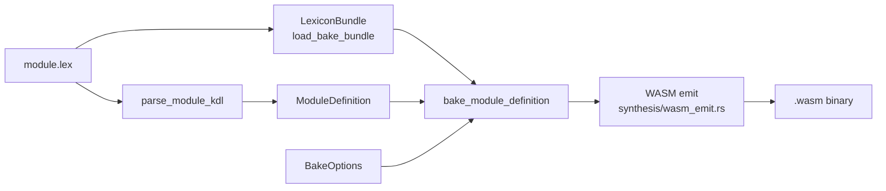

# コンパイラ

`laplan-compile` は Petri net solver と WASM バイナリ emit を担い、`laplan-inverse` は逆関手を提供します。逆関手は型宣言レベルでは全言語対応、関数/trait 抽出は Rust 固有、WASM は独立経路という 3 層構造で、詳細は本ページ後半を参照。

## laplan-compile の構成

```
compiler/compile/src/
├── api.rs              # solve, marking_from_json, SolveOutput
├── assessment.rs       # NeedAssessment, BoundaryKind
├── axiom_table.rs      # TransitionTable, Recipe, morphisms_to_transitions
├── bundle.rs           # #[cfg(feature = "bundle")] 組み込み TransitionTable
├── concurrency.rs      # ParallelDag, are_independent, has_dependency
├── convert.rs          # 型変換ヘルパ
├── diagnose.rs         # 収束診断、Dead/Orphan 検出
├── fact.rs             # Fact, Goal, Marking, InstructionFact
├── lint.rs             # Layer 0 静的検査
└── solver.rs           # BFS 本体、SearchConfig, SolveMode
```

### 公開 API の主要型

```rust
pub enum SolveOutput {
    Ok(Vec<Recipe>),
    AlreadySatisfied,
    PreflightRequired { recipe: Recipe, axiom_nsids: Vec<String> },
    AmbiguousAxiomCrossing { candidates: Vec<Recipe>, axiom_nsids: Vec<String> },
    NeedsUserAction(Vec<Fact>),
    Boundary(BoundaryKind),
    InvalidGoalSpec { goal_spec: String },
}

pub struct SearchConfig {
    pub allow_duplicate_steps: bool,
    pub enumerate_all: bool,
}

pub enum SolveMode { Execute, DryRun }
```

solver の詳細は [architecture/solver.md](solver.md) 。

### feature gate

| feature | 有効化される機能 |
|---|---|
| `bundle` (default) | `bundled_table()` による vendored-json からの `TransitionTable` 構築 |

`--no-default-features` で WASM ビルド可能にし、呼び出し側が `TransitionTable` を構築する構成も取れます。

## WASM バイナリ生成パイプライン

`synthesis/src/bake.rs` が `laplan-compile` と協調して WASM モジュールを組み立てます。


```mermaid
flowchart LR
    module[module.lex]
    bundle[LexiconBundle<br/>load_bake_bundle]
    parse[parse_module_kdl]
    def[ModuleDefinition]
    opts[BakeOptions]
    bake[bake_module_definition]
    emit[WASM emit<br/>synthesis/wasm_emit.rs]
    wasm[.wasm binary]

    module --> parse --> def
    module --> bundle
    bundle --> bake
    def --> bake
    opts --> bake
    bake --> emit --> wasm
```

### BakeOptions

```rust
pub struct BakeOptions {
    pub simd: bool,              // --simd: SIMD 最適化
    pub parallel: bool,          // --parallel: 並列実行 DAG の組込
    pub parallel_target: VectorizeTarget,
    pub constant_time: bool,     // --constant-time: timing 攻撃耐性
}
```

CLI フラグとの対応:

| フラグ | 意味 | 前提 |
|---|---|---|
| `--bake` | モジュールを WASM に焼き込む | `emit-wasm` サブコマンド |
| `--simd` | `v128` ベクトル演算で書き換え | `--bake` |
| `--parallel` | `ParallelDag` を組み込み並列化 | `--bake` |
| `--constant-time` | 分岐と table lookup を回避 | `--bake` |
| `--bind <typescript\|python>` | WASM に対する言語バインディングを生成 | `--bake` |
| `--server-output` | サーバ実装 stub を生成 | `--bake` |

### WASM emit 層

`synthesis/src/wasm_emit.rs` と `wasm_lower.rs` が Lex₂ IR (`Stmt` / `Expr`) を WASM バイトコードに変換します。

| 型 | 役割 |
|---|---|
| `WasmValType` (`I32`/`I64`/`F32`/`F64`/`V128`) | 値型 |
| `WasmFuncType` | 関数シグネチャ (params + results + locals) |
| `WasmImport` / `WasmExport` | import / export エントリ |
| `WasmModule` | 完成した WASM モジュール |

`wasm_bindgen_output.rs` が TypeScript / Python バインディングを生成します。

## derives 展開

`axiom/` の rule に書かれた `derives { vectorize f32 4; ... }` のような宣言は、`synthesis/src/derives_resolve.rs` で具体的な transition に展開されます。

| derive | 効果 |
|---|---|
| `vectorize <type> <count>` | 要素単位の axiom から SIMD / 並列版を自動導出 |
| `family.product` | 成分単位演算を family メンバから導出 |
| `lift` / `compose` | 圏論プリミティブによる合成 |

展開結果は `TransitionTable` に追加され、solver が経路として選択可能になります。

## laplan-inverse: 逆関手

逆関手は「生成コード → `.lex` スケルトン」を取り出し、往復変換 (roundtrip) で設計の妥当性を検証します。`ast_inverse/` + `wasm/` の 2 経路を `emit.rs` が `.lex` テキストに落とし、`equiv.rs` が論理等価を判定します。

```
compiler/inverse/src/
├── lib.rs                       # 公開入口 + 再 export
├── source.rs                    # SourceFile, InverseOutput, InverseWarning (共通型)
├── equiv.rs                     # LexiconIr 論理等価判定 (roundtrip テスト用)
├── emit.rs                      # .lex テキスト生成 (言語非依存)
├── ast_inverse/                 # 21 言語共通の AST inverse pass
│   ├── engine.rs                # AST pattern matcher + body 再帰 matcher
│   │                            # + 制御構造 parser (if/for/while/match)
│   │                            # + Expr 構造化 parser (method chain / match / if-let-test / guarded pattern)
│   ├── mapping_driver.rs        # mapping.lex の pattern セクション駆動 adapter
│   │                            # (control / variable / handler / endpoint / functional)
│   ├── type_table.rs            # InverseTypeTable (type_map 逆引き)
│   ├── product.rs / sum.rs / alias.rs
│   ├── control.rs               # if/for/fn/module/match
│   ├── variable.rs              # binding/mutable-binding/assign/return
│   ├── handler.rs               # endpoint handler (body: Vec<Stmt> 保持)
│   └── rule_chain.rs            # rule precondition / chain morphism
└── wasm/                        # WASM 固有 (セクション直読み)
    ├── read.rs                  # WASM Type/Import/Export セクション解析
    └── inverse.rs               # WASM 型 → Lexicon 型
```

### 責務の 2 経路

| 経路 | 入力 | 方式 | 対応範囲 |
|---|---|---|---|
| AST inverse pass (`ast_inverse/`) | 生成ソース | `engine.rs` が FnExpr / Stmt / Expr パターンを逆引きし、`mapping_driver.rs` が mapping.lex の `syntax` + `expr` dual schema を駆動 | **全 21 言語** (mapping.lex 駆動) |
| WASM バイナリ → 型復元 (`wasm/`) | `.wasm` | セクション直読み | WASM 独立 |

`ast_inverse` は `product` / `sum` / `alias` の型宣言復元に加え、`control` / `variable` / `handler` / `rule_chain` の pass で endpoint / rule-guard / chain / const / assign を復元します。`mapping_driver` registry が control / variable / handler / endpoint / functional の 5 ドライバを mapping.lex の pattern セクションから駆動します。`equiv.rs` の `assert_lex_equivalent` が roundtrip テストでの論理等価判定を担います。

### 公開入口

```rust
// 言語非依存入口 (21 言語 + wasm で動作)
pub fn invert_source_to_lex(
    target: &str,
    mapping: &Mapping,
    sources: &[SourceFile],
    namespace: &str,
) -> Result<InverseOutput, InverseError>;

// Rust 向け thin wrapper (`invert_source_to_lex("rust", ...)` を呼ぶ)
pub fn invert_rust_crate(
    crate_src_dir: &Path,
    mapping: &Mapping,
    namespace: &str,
    type_table: &InverseTypeTable,
) -> Result<InverseOutput, InverseError>;

// WASM 入口
pub fn invert_wasm_binary(
    wasm_bytes: &[u8],
    namespace: &str,
) -> Result<InverseOutput, InverseError>;
```

`invert_source_to_lex` の引数に `Mapping` を渡す設計は `inverse → synthesis` の循環依存を避けるためです。CLI 側が `cached_mapping(target)` を呼んで inverse に渡します。

### body 構造化と `Stmt::Raw` fallback

`handler.rs` が復元する handler の body は `Vec<Stmt>` で保持します。意味論抽出は以下の 3 層で構成されます。

1. `engine.rs` の body 再帰 matcher が mapping.lex の `stmt {}` / `pattern {}` セクションを駆動し、statement ごとに pattern マッチを試みる
2. pattern で拾えない `if` / `for` / `while` / `match` は engine 内の制御構造 parser が構造化する (`parse_if_like` / `parse_for_like` / `parse_while_like` / `parse_match_like`)
3. Expr 構造化 parser (`structure_expr`) が let 右辺や cond を `Expr::MethodChain` / `Expr::Match` / `Expr::IfElse` / `Expr::IfLetTest` / `Expr::Construct` / `Expr::FieldAccess` / `Expr::Call` に昇格する

いずれでも構造化できない断片は `Stmt::Raw(String)` / `Expr::Raw(String)` / `Pattern::Raw(String)` に落とし、artifact 上で未対応箇所として可視化します。shortcut としての `body_raw: String` は持たず、失敗は常に Raw variant として表面化する設計です。

engine の stmt 境界検出は `(` / `{` / `[` のネスト深度追跡を伴い、`Self { ... }` / `Ok(Enum::Variant { ... })` / `match x { ... }` のような閉じた block を含む expression-stmt を単一 stmt として捉えます。body 構造化前段で `strip_comments` が行 `//` と block `/* */` を除去し、string literal 内の `//` は文字列追跡で除外します (doc comment `///` `//!` は field-doc 経路で保持)。`structure_expr` は mapping.lex `expr.variant.{construct-self, result-ok, result-err}` 経由で `Self { ... }` / `Ok(...)` / `Err(...)` を `Expr::Construct` に昇格し、`parse_let_complex` は let RHS が `match` / `if-else` の場合に `Expr::Match` / `Expr::IfElse` へ、let LHS が `StructName { f1, f2 }` の場合に `Pattern::Struct` へ構造化します。trait 定義 body は `body_contains_implementation` 判定で signature-only を識別し、空 body の handler として扱います。

### 対応範囲

逆変換は全 21 言語で mapping.lex 駆動に統一されています。`invert_source_to_lex` が言語非依存の入口で、`invert_rust_crate` は `invert_source_to_lex("rust", ...)` を呼ぶ thin wrapper です。`ast_inverse/` の各 pass が mapping.lex の `syntax` セクション + `expr {}` dual schema (pattern 記述) を読んで product / sum / alias / endpoint / rule-guard / chain / const / assign を復元します。

### 逆変換対象の構造カテゴリ

型宣言だけでなく、`.lex` の主要構造は以下のように synthesis 出力に落ちます。これらを復元することが逆変換の完全性の基準になります。

| .lex 構造 | 言語側の出力 | 復元経路 |
|---|---|---|
| `type` | 組込型参照 | `ast_inverse::type_table` が mapping.lex の `type_map` を逆引き |
| `lexicon` (procedure / query / subscription) | endpoint ハンドラ関数 / trait メソッド | mapping.lex `handler {}` セクション逆引き |
| `lexicon` (object / record) | struct / data class | `syntax { product }` 逆引き |
| sum / union | enum / sealed / tagged union | `syntax { sum }` 逆引き |
| alias | type alias / newtype | `syntax { alias }` 逆引き |
| `rule` の条件制約 | if / match / guard / precondition | `control { if }` / handler の guard-prefix 逆引き |
| `morph.chain` | 関数合成 / pipeline / method chain | `control { fn }` + chain-step テンプレート逆引き |
| `const` / `assign` | 定数 / 可変束縛 | `variable { binding, mutable-binding }` 逆引き |
| `func.law` / `dual` / `invariant` | 通常コードに現れない | 逆変換なし (warning で報告) |

`ast_inverse` は product / sum / alias / endpoint / rule-guard / chain / const / assign の全カテゴリを 21 言語で対応します。復元できなかった構造は `InverseWarning` として報告されます。

### roundtrip テスト

`roundtrip_tests.rs` / `wasm_roundtrip_tests.rs` が、`.lex` → synthesis → inverse の結果が元の `.lex` と一致することを検証します。`atproto-core-tests` feature で AT Protocol core 固有のテストを gate できます。

多言語 roundtrip テストは `roundtrip_tests.rs` / `wasm_roundtrip_tests.rs` で product / sum / alias をカバーしています。

## ネットワーク取得

`ir::github_fetch` (feature = "filesystem") が GitHub から cratis を取得できます。cratis 側で `path` の代わりに GitHub URL を指定する運用で使われます。
