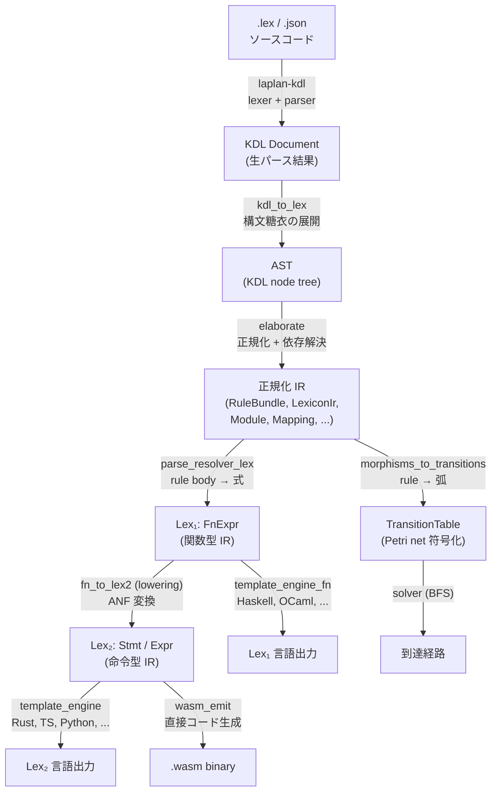
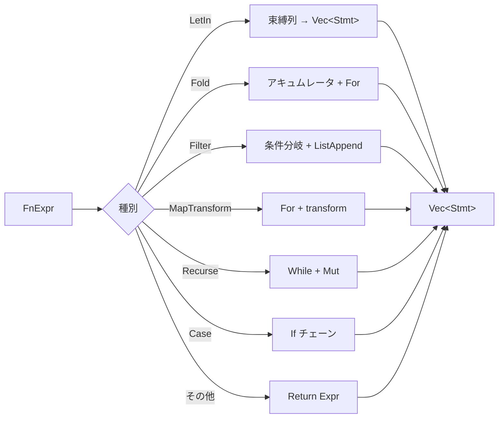

# 中間表現

`laplan-ir` は `.lex` 宣言の正規化表現を提供し、Lex₁ (関数型) と Lex₂ (命令型) の二層 IR で式と文を扱います。

## IR 階層の全体像

`.lex` ソースから最終出力までの間に 5 段の中間表現を経由します。各段が特定の情報を捨てることで、後段の処理に適した形に変換されます。



Lex₁ → Lex₂ の lowering と IR → TransitionTable の変換は独立した経路です。同じ正規化 IR から、コード生成と到達可能性解析という 2 つの異なる目的のために異なる情報を抽出しています。

### 各段が何を捨てて何を得るか

| 段階 | 表現 | 捨てるもの | 得るもの |
|---|---|---|---|
| KDL Document | neco-kdl の汎用 KDL ノード | - | 文法正しさの保証 |
| AST | `.lex` の意味ノード | KDL 構文の冗長性 (`{`, `}`, `;`) | `.lex` 固有の構造 (rule, morph, family 等) |
| 正規化 IR | RuleBundle, LexiconIr 等 | 省略形、構文糖衣 | 型接続、NSID 解決、依存の正規化 |
| Lex₁ (FnExpr) | 関数型の式木 | 宣言の構造 | 純粋な式の意味論 (let-in, fold, recurse) |
| Lex₂ (Stmt/Expr) | 命令型の文列 | 式の入れ子構造 | 逐次実行の意味論 (let, while, return) |
| TransitionTable | Petri net の弧 | 関数本体 | 型の消費・生産関係のみ |

### Lex₁ パスと Lex₂ パスの並存

通常のコンパイラでは高水準 IR → 低水準 IR → ターゲットの一本道ですが、laplan は Lex₁ から直接出力する言語 (Haskell, OCaml, Gleam, Elixir) と、Lex₂ に降格してから出力する言語 (残り 17 言語 + WASM) を使い分けます。`has_functional_templates()` が mapping.lex の `functional {}` セクションの有無で自動分岐します。詳細は [synthesis.md](synthesis.md) の「Lex₁ パス vs Lex₂ パス」節。

## 主要な型

### 宣言系

| 型 | 場所 | 役割 |
|---|---|---|
| `RuleBundle` | `rule.rs` | rule / const / assign / chain の集合。solver の入力 |
| `LexiconIr` | `lib.rs` | lexicon 宣言の正規化表現。`LexiconKind`, `LexiconObject`, `LexiconField` |
| `Module` | `module.rs` | `.lex` ファイル全体の集約 |
| `LibConfig` | `lib_config.rs` | cratis / face / member 宣言 |
| `BuildConfig` | `build_config.rs` | 生成ターゲット (`EmitTarget`, `BoundaryRule`) |
| `FamilyTable` | `family.rs` | family 宣言 (product, vectorize 等) |
| `Mapping` | `mapping.rs` | 言語 mapping (type_map, lowering, functional セクション等) |
| `RefinementDecl` | `refinement.rs` | 既存 lexicon への制約追加 |
| `VendorManifest` | `lib.rs` | vendored-json の manifest |

### 式と文

IR は関数を 2 層で表現します。ユーザーが `rule.body` として書く関数型の式を Lex₁ で受け取り、`lowering` で Lex₂ に降格してからコード生成に渡します。

| 層 | 型 | 用途 |
|---|---|---|
| Lex₁ | `FnExpr` (`fn_expr.rs`) | 関数型言語向け (Haskell / OCaml / Gleam / Elixir) |
| Lex₂ | `Stmt` / `Expr` (`stmt_expr.rs`) | 命令型言語向け (残り 17 言語 + WASM) |

## Lex₁: FnExpr

関数型スタイルの式表現です。let-in, lambda, fold, filter, map-transform, case-of, Recurse (safe recursive) 等をサポートします。

```rust
pub enum FnExpr {
    Var(String),
    StringLit(String),
    IntLit(i64),
    BoolLit(bool),
    App(String, Vec<FnExpr>),
    Lambda(Vec<(String, String)>, Box<FnExpr>),
    Fold { f, init, collection },
    Recurse { base_case, base_value, step, state },
    Filter(Box<FnExpr>, Box<FnExpr>),
    MapTransform(Box<FnExpr>, Box<FnExpr>),
    LetIn { bindings, body },
    Case { target, branches },
    FieldAccess(Box<FnExpr>, String),
    Construct(String, Vec<(String, FnExpr)>),
    ListLit(Vec<FnExpr>),
    MapFromList(Box<FnExpr>),
    MapLookup(Box<FnExpr>, Box<FnExpr>),
    MapMember(Box<FnExpr>, Box<FnExpr>),
    Null,
    IsNothing(Box<FnExpr>),
    FromMaybe(Box<FnExpr>, Box<FnExpr>),
    Not(Box<FnExpr>),
    BinaryOp(String, Box<FnExpr>, Box<FnExpr>),
    ErrorRaise(String),
    Tuple(Vec<FnExpr>),
    Fst(Box<FnExpr>),
    Snd(Box<FnExpr>),
    Head(Box<FnExpr>),
    NullCheck(Box<FnExpr>),
    Concat(Box<FnExpr>, Box<FnExpr>),
}
```

`Recurse` は safe recursive (`recursive.bounded` / `recursive.decreasing`) の表現で、While + Mut への降格により再帰パターンをループに変換できます。

### resolver.lex: FnExpr の KDL 記述

`axiom/resolver.lex` は FnExpr を KDL で直接記述する .lex バリアントです。runtime resolver の 7 関数 (loadRecipes, dispatchRecipeStep, checkNeeds, classifyCandidate, executeRecipe, resolve, fetchGoal) を宣言的に定義し、source of truth として機能します。

`parse_resolver_lex()` (`fn_expr.rs`) が KDL → `Vec<FnDef>` の semantic interpreter を提供します。KDL パーサ ([neco-kdl](https://github.com/barineco/neco-crates/tree/main/neco-kdl)) の上に FnExpr variant へのマッピング層を載せた構造で、標準の KDL 構文のみを使用します。

KDL ノード名は `functional {}` テンプレートのキー名と対応します:

| KDL ノード | FnExpr variant | 子ノード |
|---|---|---|
| `fn "name" { ... }` | `FnDef` | `params`, `return-type`, `body` |
| `var "x"` | `Var` | - |
| `string "..."` | `StringLit` | - |
| `int 42` | `IntLit` | - |
| `bool #true` | `BoolLit` | - |
| `null-literal` | `Null` | - |
| `app "f" { arg { ... } }` | `App` | `arg` (複数) |
| `lambda { params { ... } body { ... } }` | `Lambda` | `params`, `body` |
| `fold { fn { ... } init { ... } collection { ... } }` | `Fold` | `fn`, `init`, `collection` |
| `recurse { ... }` | `Recurse` | `base-case`, `base-value`, `step`, `state` |
| `filter { predicate { ... } collection { ... } }` | `Filter` | `predicate`, `collection` |
| `map-transform { transform { ... } collection { ... } }` | `MapTransform` | `transform`, `collection` |
| `let-in { binding "x" type="T" { value { ... } } body { ... } }` | `LetIn` | `binding` (複数), `body` |
| `case { target { ... } branch constructor="C" { ... } }` | `Case` | `target`, `branch` (複数) |
| `field "name" { target { ... } }` | `FieldAccess` | `target` |
| `construct "C" { field "f" { value { ... } } }` | `Construct` | `field` (複数) |
| `list { item { ... } }` | `ListLit` | `item` (複数) |
| `tuple { item { ... } }` | `Tuple` | `item` (複数) |
| `map-from-list { inner { ... } }` | `MapFromList` | `inner` |
| `map-lookup { target { ... } key { ... } }` | `MapLookup` | `target`, `key` |
| `map-member { target { ... } key { ... } }` | `MapMember` | `target`, `key` |
| `is-nothing { value { ... } }` | `IsNothing` | `value` |
| `from-maybe { default { ... } value { ... } }` | `FromMaybe` | `default`, `value` |
| `not { value { ... } }` | `Not` | `value` |
| `binary op="+" { left { ... } right { ... } }` | `BinaryOp` | `left`, `right` |
| `error-raise "msg"` | `ErrorRaise` | - |
| `fst { value { ... } }` | `Fst` | `value` |
| `snd { value { ... } }` | `Snd` | `value` |
| `head { value { ... } }` | `Head` | `value` |
| `null-check { value { ... } }` | `NullCheck` | `value` |
| `concat { left { ... } right { ... } }` | `Concat` | `left`, `right` |

case の `branch` はパターンを property で指定します: `constructor="Name"` (バインド変数は子の `bind "var"`), `tuple=#true`, `wildcard=#true`。

パース結果は既存の lowering (`fn_to_lex2`) と template_engine_fn (`emit_fn_expr`) にそのまま流れ、全 21 言語 + Lex₁ 4 言語に resolver コードを生成します。`runtime_program_fn.rs` は `include_str!("../../../axiom/resolver.lex")` で resolver.lex を取り込み、`functional_resolve_program()` として `Vec<FnDef>` を返します。

## Lex₂: Stmt / Expr

命令型スタイルの文と式です。if / for / while / let / mut / return / continue と、atomic 操作や WASM 固有の store 操作を含みます。

```rust
pub enum Stmt {
    Let { name, ty, value },
    Mut { name, ty, value },
    Assign { target, value },
    If { cond, then_body, else_body },
    For { var, collection, body },
    While { cond, body },
    Return(Expr),
    Continue,
    StoreOp(String, Expr, Expr),
    AtomicStore { mnemonic, addr, value },
}

pub enum Expr {
    Var, StringLit, IntLit, BoolLit, I64Const,
    UnaryOp, BinaryOp, Tuple, Null,
    MapGet, MapContains, FieldAccess,
    ListEmpty, ListAppend, NewList, CopyMap,
    Call, Construct,
    IsNull, Not, First, ErrorRaise,
    AtomicLoad, AtomicRmwAdd, AtomicWait, // ...
}
```

`RuntimeFn` は Lex₂ の関数定義で、`name`, `params`, `return_type`, `body: Vec<Stmt>` を持ちます。

## lowering: Lex₁ → Lex₂

`lowering.rs` の `fn_to_lex2(def: &FnDef) -> RuntimeFn` が降格の入口です。



| 元の FnExpr | 降格後 | 備考 |
|---|---|---|
| `LetIn` | `Let` / `Mut` 列 | binding.ty に応じて `Let` か `Mut` |
| `Fold` | `Let acc` + `For` | アキュムレータを可変化 |
| `Filter` | `NewList` + `For` + `If` + `ListAppend` | 要素ごとに条件判定 |
| `MapTransform` | `NewList` + `For` + `ListAppend` | 要素ごとに変換 |
| `Recurse` | `Mut state` + `While` | base_case が成立するまでループ |
| `Case` | `If` チェーン | constructor / tuple pattern を分岐 |
| その他 | `Return` + `Expr` | 素通し変換 |

Lex₂ パスは Lex₁ IR からの自動降格のみで構成されます。

## module / cratis の IR 表現

`module.rs` の `Module` がファイル単位の集約。`LibConfig` (`lib_config.rs`) が cratis を表現し、`members`, `faces`, `provides`, `requires` を持ちます。

```rust
pub struct CratisConfig {
    pub name: String,
    pub version: u32,
    pub members: Vec<CratisSource>,
    pub faces: Vec<FaceConfig>,
    // provides / requires / axiom
}
```

cratis は単体パッケージとワークスペースを兼ねます (members の有無で判定)。詳細は [guide/cratis.md](../guide/cratis.md) 。

## feature gate

| feature | 有効化される機能 |
|---|---|
| `filesystem` (default) | `std::fs` 依存の関数 (`paths`, `github_fetch`, `load_bundled_manifest`) + `atproto-lexicon-vendored` |

`--no-default-features` で WASM ターゲットにビルド可能です。パーサ core (`parse_base_json`, `parse_kdl_lexicons_native`, `parse_rule_kdl`, `elaborate`, `rule_bundle_to_canonical`) は常に利用できます。
