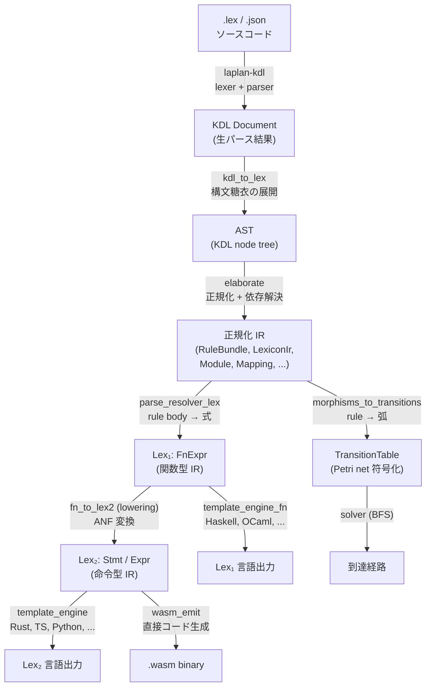
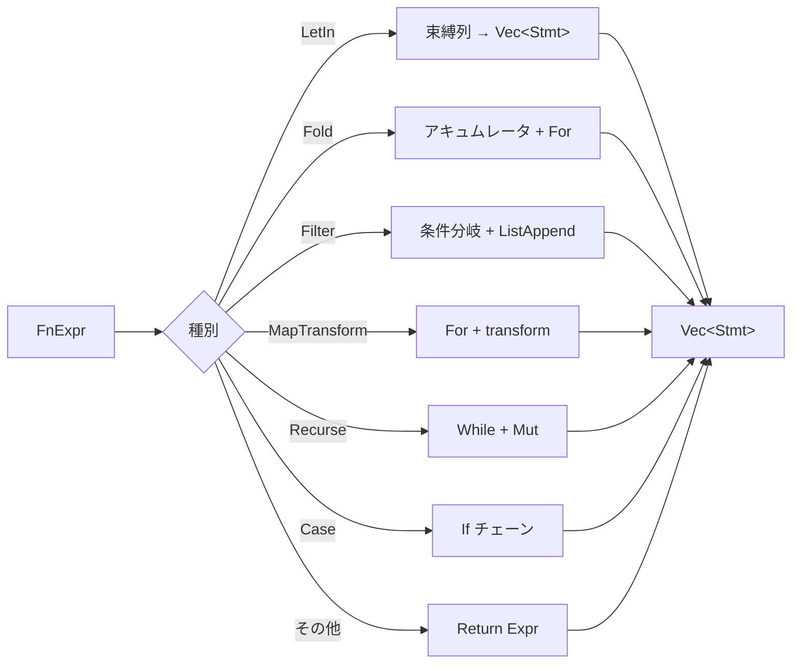
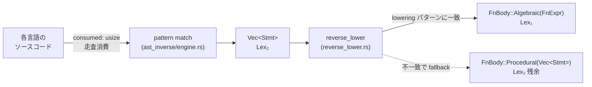

# 中間表現

`laplan-ir` は `.lex` 宣言の正規化表現を提供し、Lex₁ (関数型) と Lex₂ (命令型) の二層 IR で式と文を扱います。

## IR 階層の全体像

`.lex` ソースから最終出力までの間に 5 段の中間表現を経由します。各段が特定の情報を捨てることで、後段の処理に適した形に変換されます。


```mermaid
flowchart TD
    src[".lex / .json<br/>ソースコード"]
    kdl["KDL Document<br/>(生パース結果)"]
    ast["AST<br/>(KDL node tree)"]
    ir["正規化 IR<br/>(RuleBundle, LexiconIr,<br/>Module, Mapping, ...)"]
    lex1["Lex₁: FnExpr<br/>(関数型 IR)"]
    lex2["Lex₂: Stmt / Expr<br/>(命令型 IR)"]
    tt["TransitionTable<br/>(Petri net 符号化)"]

    src -->|"laplan-kdl<br/>lexer + parser"| kdl
    kdl -->|"kdl_to_lex<br/>構文糖衣の展開"| ast
    ast -->|"elaborate<br/>正規化 + 依存解決"| ir
    ir -->|"parse_resolver_lex<br/>rule body → 式"| lex1
    lex1 -->|"fn_to_lex2 (lowering)<br/>ANF 変換"| lex2
    ir -->|"morphisms_to_transitions<br/>rule → 弧"| tt

    lex1 -->|"template_engine_fn<br/>Haskell, OCaml, ..."| out1["Lex₁ 言語出力"]
    lex2 -->|"template_engine<br/>Rust, TS, Python, ..."| out2["Lex₂ 言語出力"]
    lex2 -->|"wasm_emit<br/>直接コード生成"| out3[".wasm binary"]
    tt -->|"solver (BFS)"| out4["到達経路"]
```

Lex₁ → Lex₂ の lowering と IR → TransitionTable の変換は独立した経路です。同じ正規化 IR から、コード生成と到達可能性解析という 2 つの異なる目的のために異なる情報を抽出しています。

### 各段が何を捨てて何を得るか

| 段階 | 表現 | 捨てるもの | 得るもの |
|---|---|---|---|
| KDL Document | neco-kdl の汎用 KDL ノード | - | 文法正しさの保証 |
| AST | `.lex` の意味ノード | KDL 構文の冗長性 (`{`, `}`, `;`) | `.lex` 固有の構造 (rule, morph, family 等) |
| 正規化 IR | RuleBundle, LexiconIr 等 | 省略形、構文糖衣 | 型接続、NSID 解決、依存の正規化 |
| Lex₁ (FnExpr) | 関数型の式木 | 宣言の構造 | 純粋な式の意味論 (let-in, fold, recurse) |
| Lex₂ (Stmt/Expr) | 命令型の文列 | 式の入れ子構造 | 逐次実行の意味論 (let, while, return) |
| TransitionTable | Petri net の弧 | 関数本体 | 型の消費・生産関係のみ |

### Lex₁ パスと Lex₂ パスの並存

通常のコンパイラでは高水準 IR から低水準 IR を経てターゲットに至る一本道ですが、laplan は Lex₁ から直接出力する言語と、Lex₂ に降格してから出力する言語を使い分けます。分岐判定は `has_functional_templates()` (`compiler/synthesis/src/backends/generic.rs`) が mapping.lex の `functional {}` セクションの有無で行います。

21 言語の所属は以下の通りです。

| 分類 | 言語 | 備考 |
|---|---|---|
| Lex₁ 直接 emit | haskell, ocaml, gleam, elixir | mapping.lex に `functional {}` を持つ。4 言語 |
| Lex₂ 経由 emit | rust, cpp, zig, java, kotlin, csharp, d, go, swift, javascript, typescript, dart, php, python, ruby, lua, clojure | `functional {}` を持たず lowering で降格 (clojure は Lisp 系だが Lex₂ 経由、17 言語) |

合計 21 言語。WASM は Lex₂ から直接バイナリを生成する経路で、21 言語の内訳とは独立しており、Lex₂ パスを共有します。詳細な振り分け実装は [synthesis.md](synthesis.md) の「Lex₁ パス vs Lex₂ パス」節で扱います。

## 主要な型

### 宣言系

| 型 | 場所 | 役割 |
|---|---|---|
| `RuleBundle` | `rule.rs` | rule / const / assign / chain の集合。solver の入力 |
| `LexiconIr` | `lib.rs` | lexicon 宣言の正規化表現。`LexiconKind`, `LexiconObject`, `LexiconField` |
| `Module` | `module.rs` | `.lex` ファイル全体の集約 |
| `LibConfig` | `lib_config.rs` | cratis / face / member 宣言 |
| `BuildConfig` | `build_config.rs` | 生成ターゲット (`EmitTarget`, `BoundaryRule`) |
| `FamilyTable` | `family.rs` | family 宣言 (product, vectorize 等) |
| `Mapping` | `mapping.rs` | 言語 mapping (type_map, lowering, functional セクション等) |
| `RefinementDecl` | `refinement.rs` | 既存 lexicon への制約追加 |
| `VendorManifest` | `lib.rs` | vendored-json の manifest |

### 式と文

IR は関数を 2 層で表現します。ユーザーが `rule.body` として書く関数型の式を Lex₁ で受け取り、`lowering` で Lex₂ に降格してからコード生成に渡します。

| 層 | 型 | 用途 |
|---|---|---|
| Lex₁ | `FnExpr` (`fn_expr.rs`) | 関数型言語向け (Haskell / OCaml / Gleam / Elixir) |
| Lex₂ | `Stmt` / `Expr` (`stmt_expr.rs`) | 命令型言語向け (残り 17 言語 + WASM) |

## Lex₁: FnExpr

関数型スタイルの式表現です。let-in, lambda, fold, filter, map-transform, case-of, Recurse (safe recursive) 等をサポートします。

```rust
pub enum FnExpr {
    Var(String),
    StringLit(String),
    IntLit(i64),
    BoolLit(bool),
    App(String, Vec<FnExpr>),
    Lambda(Vec<(String, String)>, Box<FnExpr>),
    Fold { f, init, collection },
    Recurse { base_case, base_value, step, state },
    Filter(Box<FnExpr>, Box<FnExpr>),
    MapTransform(Box<FnExpr>, Box<FnExpr>),
    LetIn { bindings, body },
    Case { target, branches },
    FieldAccess(Box<FnExpr>, String),
    Construct(String, Vec<(String, FnExpr)>),
    ListLit(Vec<FnExpr>),
    MapFromList(Box<FnExpr>),
    MapLookup(Box<FnExpr>, Box<FnExpr>),
    MapMember(Box<FnExpr>, Box<FnExpr>),
    Null,
    IsNothing(Box<FnExpr>),
    FromMaybe(Box<FnExpr>, Box<FnExpr>),
    Not(Box<FnExpr>),
    BinaryOp(String, Box<FnExpr>, Box<FnExpr>),
    ErrorRaise(String),
    Tuple(Vec<FnExpr>),
    Fst(Box<FnExpr>),
    Snd(Box<FnExpr>),
    Head(Box<FnExpr>),
    NullCheck(Box<FnExpr>),
    Concat(Box<FnExpr>, Box<FnExpr>),
}
```

`Recurse` は safe recursive (`recursive.bounded` / `recursive.decreasing`) の表現で、While + Mut への降格により再帰パターンをループに変換できます。

### resolver.lex: FnExpr の KDL 記述

`axiom/resolver.lex` は FnExpr を KDL で直接記述する .lex バリアントです。runtime resolver の 9 関数 (loadRecipes, dispatchRecipeStep, checkNeeds, classifyCandidate, failGoalUnreachable, resolveFromCandidates, executeRecipe, resolve, fetchGoal) を宣言的に定義し、source of truth として機能します。

`parse_resolver_lex()` (`fn_expr.rs`) が KDL → `Vec<FnDef>` の semantic interpreter を提供します。KDL パーサ ([neco-kdl](https://github.com/barineco/neco-crates/tree/main/neco-kdl)) の上に FnExpr variant へのマッピング層を載せた構造で、標準の KDL 構文のみを使用します。

KDL ノード名は `functional {}` テンプレートのキー名と対応します:

| KDL ノード | FnExpr variant | 子ノード |
|---|---|---|
| `fn "name" { ... }` | `FnDef` | `param` (直接子), `return-type`, body = 残りの唯一の expr |
| `var "local.x"` / `$local.x` | `Var` | - (`$` shorthand は `var` の省略記法) |
| `string "..."` | `StringLit` | - |
| `int 42` | `IntLit` | - |
| `bool #true` | `BoolLit` | - |
| `null-literal` | `Null` | - |
| `app "f" { expr* }` | `App` | positional children = args |
| `lambda { param* expr }` | `Lambda` | `param` (直接子), body = 非 param の唯一の子 |
| `fold { expr expr expr }` | `Fold` | 3 positional: fn, init, collection |
| `recurse { expr expr expr binding* }` | `Recurse` | 3 positional (base-case, base-value, step) + `binding` children = state |
| `filter { expr expr }` | `Filter` | 2 positional: predicate, collection |
| `map-transform { expr expr }` | `MapTransform` | 2 positional: transform, collection |
| `let-in { binding* expr }` | `LetIn` | `binding` children (value は直接子) + 非 binding = body |
| `case { expr branch* }` | `Case` | 非 branch child = target + `branch` children |
| `field "name" { expr }` | `FieldAccess` | 唯一の子 = target |
| `construct "C" { field "f" { expr } }` | `Construct` | `field` children (value は直接子) |
| `list { expr* }` | `ListLit` | positional children |
| `tuple { expr* }` | `Tuple` | positional children |
| `map-from-list { expr }` | `MapFromList` | 唯一の子 |
| `map-lookup { expr expr }` | `MapLookup` | 2 positional: target, key |
| `map-member { expr expr }` | `MapMember` | 2 positional: target, key |
| `is-nothing { expr }` | `IsNothing` | 唯一の子 |
| `from-maybe { expr expr }` | `FromMaybe` | 2 positional: default, value |
| `not { expr }` | `Not` | 唯一の子 |
| `binary op="+" { expr expr }` | `BinaryOp` | 2 positional: left, right |
| `error-raise "msg"` | `ErrorRaise` | - |
| `fst { expr }` | `Fst` | 唯一の子 |
| `snd { expr }` | `Snd` | 唯一の子 |
| `head { expr }` | `Head` | 唯一の子 |
| `null-check { expr }` | `NullCheck` | 唯一の子 |
| `concat { expr expr }` | `Concat` | 2 positional: left, right |

case の `branch` はパターンを property で指定します: `constructor="Name"` (バインド変数は子の `bind "var"`), `tuple=#true`, `wildcard=#true`。

### 識別子の NSID namespace

FnExpr KDL の string 識別子には由来層を示す prefix が付きます:

| prefix | 意味 | 例 |
|---|---|---|
| `local.` | 関数パラメータ / let binding | `$local.goal` |
| `lang.` | 言語 primitive / runtime utility | `app "lang.mapGetRequired"` |
| `cli.` | CLI runtime primitive | `app "cli.call"`, `$cli.ctx` |
| (なし) | 同一ファイル内定義の自己参照 | `app "resolve"` |

emit 時に prefix は除去され、言語固有コードには base name のみが出力されます。

パース結果は既存の lowering (`fn_to_lex2`) と template_engine_fn (`emit_fn_expr`) にそのまま流れ、全 21 言語 + Lex₁ 4 言語に resolver コードを生成します。`runtime_program_fn.rs` は `include_str!("../../../axiom/resolver.lex")` で resolver.lex を取り込み、`functional_resolve_program()` として `Vec<FnDef>` を返します。

## Lex₂: Stmt / Expr

命令型スタイルの文と式です。if / for / while / let / mut / return / continue と、atomic 操作や WASM 固有の store 操作を含みます。

```rust
pub enum Stmt {
    Let { pattern, ty, value },
    Mut { name, ty, value },
    Assign { target, value },
    If { cond, then_body, else_body },
    For { var, collection, body },
    While { cond, body },
    Return(Expr),
    Continue,
    StoreOp(String, Expr, Expr),
    AtomicStore { mnemonic, addr, value },
    Match { target: Expr, arms: Vec<(Pattern, Vec<Stmt>)> },
    Expr(Expr),
    Raw(String),
}

pub enum Expr {
    Var, StringLit, IntLit, BoolLit, I64Const,
    UnaryOp, BinaryOp, Tuple, Null,
    MapGet, MapContains, FieldAccess,
    ListEmpty, ListAppend, NewList, CopyMap,
    Call, Construct,
    IsNull, Not, First, ErrorRaise,
    AtomicLoad, AtomicRmwAdd, AtomicWait, // ...
    Match { target: Box<Expr>, arms: Vec<(Pattern, Expr)> },
    MethodChain { receiver: Box<Expr>, calls: Vec<(String, Vec<Expr>)> },
    IfLetTest { pattern: Box<Pattern>, rhs: Box<Expr> },
    IfElse { cond: Box<Expr>, then_body: Vec<Stmt>, else_body: Vec<Stmt> },
    Raw(String),
}
```

追加 variant の役割:

| variant | 役割 |
|---|---|
| `Stmt::Let` | `let <pattern>: <ty> = <value>;`。LHS に `Pattern` を取るため `let x = v;` の単純束縛と `let StructName { f1, f2 } = v;` の destructuring let を同一経路で扱う |
| `Stmt::Match` | `match <target> { <pattern> => <body>, ... }` 形式の文。各 arm は `(Pattern, Vec<Stmt>)` で、単一 expression arm は `Stmt::Return` 等で wrap した `Vec<Stmt>` として保持 |
| `Stmt::Expr(Expr)` | statement 位置の expression (method-call-stmt / try-stmt / macro-call-stmt)。`{expr};` で emit |
| `Stmt::Raw(String)` | 構造化に落とせない statement を verbatim で保持する fallback。逆変換 artifact に残ることで未対応箇所を可視化 |
| `Expr::Match` | expression 位置の match。arm body は単一 `Expr`、block の場合は最終式を使うか `Expr::Raw` に fallback |
| `Expr::MethodChain` | `receiver.call1(args1).call2(args2)...` 形式。iterator idiom 認識の分析対象になる |
| `Expr::IfLetTest` | `if let <pattern> = <rhs>` の条件部分。`Stmt::If { cond: Expr::IfLetTest { .. }, .. }` の形で使う |
| `Expr::IfElse` | expression 位置の if-else (`let x = if cond { 1 } else { 2 };` 等)。block body は `Vec<Stmt>` で保持し、statement 位置の `Stmt::If` とは independent |
| `Expr::Raw(String)` | 構造化に落とせない expression の verbatim fallback。`await` / `unsafe { ... }` / macro invocation 等が落ちる |

`RuntimeFn` は Lex₂ の関数定義で、`name`, `params`, `return_type`, `body: Vec<Stmt>` を持ちます。

### Pattern

match arm および `if let` の LHS を表す構造化 pattern です。Lex₂ 側の match 構造が保持し、Lex₁ 側の Case branch とは独立した型です。

```rust
pub enum Pattern {
    Wildcard,
    Binding { name: String, mutable: bool },
    VariantUnit(String),
    VariantTuple { variant: String, binds: Vec<Pattern> },
    VariantStruct { variant: String, fields: Vec<(String, Pattern)> },
    Struct { name: String, fields: Vec<(String, Pattern)> },
    Literal(String),
    Guarded { pattern: Box<Pattern>, guard: Box<Expr> },
    Raw(String),
}
```

| variant | 対応する構文 |
|---|---|
| `Wildcard` | `_` |
| `Binding` | `x` / `mut x` |
| `VariantUnit` | `None` / `Ok(_)` 相当 (binds なし) |
| `VariantTuple` | `Some(x)` / `Ok(value)` / `Err(e)` |
| `VariantStruct` | match arm での sum 型 variant 破壊 (`Some(Point { x, y })` の `Point { x, y }` 部分等) |
| `Struct` | product 型 struct そのものの destructuring (`let StructName { f1, f2 } = v;` の LHS 等)。`VariantStruct` とは文脈が異なる |
| `Literal` | `0` / `"str"` / `true` 等のリテラル |
| `Guarded` | `<pattern> if <guard>` 形式の match arm guard |
| `Raw(String)` | 構造化に落とせない pattern の verbatim fallback |

## lowering: Lex₁ → Lex₂

`lowering.rs` の `fn_to_lex2(def: &FnDef) -> RuntimeFn` が降格の入口です。


```mermaid
flowchart LR
    src[FnExpr] --> classify{種別}
    classify -- LetIn --> bindings[束縛列 → Vec&lt;Stmt&gt;]
    classify -- Fold --> fold[アキュムレータ + For]
    classify -- Filter --> filter[条件分岐 + ListAppend]
    classify -- MapTransform --> mapt[For + transform]
    classify -- Recurse --> recurse[While + Mut]
    classify -- Case --> case[If チェーン]
    classify -- その他 --> expr[Return Expr]
    bindings --> stmts[Vec&lt;Stmt&gt;]
    fold --> stmts
    filter --> stmts
    mapt --> stmts
    recurse --> stmts
    case --> stmts
    expr --> stmts
```

| 元の FnExpr | 降格後 | 備考 |
|---|---|---|
| `LetIn` | `Let` / `Mut` 列 | binding.ty に応じて `Let` か `Mut` |
| `Fold` | `Let acc` + `For` | アキュムレータを可変化 |
| `Filter` | `NewList` + `For` + `If` + `ListAppend` | 要素ごとに条件判定 |
| `MapTransform` | `NewList` + `For` + `ListAppend` | 要素ごとに変換 |
| `Recurse` | `Mut state` + `While` | base_case が成立するまでループ |
| `Case` | `If` チェーン | constructor / tuple pattern を分岐 |
| その他 | `Return` + `Expr` | 素通し変換 |

Lex₂ パスは Lex₁ IR からの自動降格のみで構成されます。

## inverse: 各言語 → Lex₂ → Lex₁

forward の降格 (lowering) に対となる経路として、各言語のソースコードを Lex₂ に読み戻し、可能な範囲で Lex₁ に昇格 (lift) させる inverse パイプラインがあります。roundtrip 検証や、既存コードベースの取り込みに利用します。


```mermaid
flowchart LR
    src["各言語の<br/>ソースコード"]
    pm["pattern match<br/>(ast_inverse/engine.rs)"]
    stmts["Vec&lt;Stmt&gt;<br/>Lex₂"]
    rl["reverse_lower<br/>(reverse_lower.rs)"]
    lex1["FnBody::Algebraic(FnExpr)<br/>Lex₁"]
    residual["FnBody::Procedural(Vec&lt;Stmt&gt;)<br/>Lex₂ 残余"]

    src -->|"consumed: usize<br/>走査消費"| pm
    pm --> stmts
    stmts --> rl
    rl -->|"lowering パターンに一致"| lex1
    rl -.->|"不一致で fallback"| residual
```

各段の責務は以下の通りです。

| 段 | 関数 | 役割 |
|---|---|---|
| pattern match | `ast_inverse::engine` の `PatternNode` + `MatchResult { consumed, captures, ast_matches }` | ソース文字列を `consumed` バイト単位で走査し、mapping.lex の `pattern` template から派生したパターンに照合する |
| lift | `reverse_lower::reverse_lower` | `Vec<Stmt>` 全体を `FnBody` に変換する total function。`lowering::fn_to_lex2` のパターンと一対一で対応した認識器 (`recognize_body` → `recognize_fold` / `recognize_filter` / `recognize_let_in` など) と `lift_expr` による式の再構築を経て、一致すれば `FnBody::Algebraic(FnExpr)` を、一致しなければ `FnBody::Procedural(Vec<Stmt>)` を返す |
| 可視化 fallback | `Stmt::Raw(String)` / `Expr::Raw(String)` | pattern match 段で構造化に至らなかった断片を verbatim で保持する。未対応箇所を silent に隠さずに明示するための仕組み |

`reverse_lower` は `lowering::fn_to_lex2` の forward パターンと一対一で対応しており、laplan 自身が emit した `resolver.lex` の 9 関数はすべて Algebraic に復元されます。既存の言語ソースを読み戻す場合、builder 風の構造や method 連鎖など lowering パターンの外側にあるコードは `FnBody::Procedural` として Lex₂ のまま残り、その残余には `Stmt::Raw` / `Expr::Raw` が含まれうるため、未対応箇所の所在がそのまま可視化されます。

## module / cratis の IR 表現

`module.rs` の `Module` がファイル単位の集約。`LibConfig` (`lib_config.rs`) が cratis を表現し、`members`, `faces`, `provides`, `requires` を持ちます。

```rust
pub struct CratisConfig {
    pub name: String,
    pub version: u32,
    pub members: Vec<CratisSource>,
    pub faces: Vec<FaceConfig>,
    // provides / requires / axiom
}
```

cratis は単体パッケージとワークスペースを兼ねます (members の有無で判定)。詳細は [guide/cratis.md](../guide/cratis.md) 。

## 消費 (consume) の 2 系統

laplan では「消費」という語が 2 つの異なる文脈で現れます。混同すると設計判断を誤るので、明示的に区別します。

| 系統 | 所在 | 意味 | 関連概念 |
|---|---|---|---|
| Petri net の `consumes` | solver / rule 宣言 | transition の発火で marking から token を除去する | `produces` / `requires` / marking |
| pattern match の `consumed` | inverse パイプライン (engine.rs) | pattern match がソース文字列を走査して消費したバイト数 | cursor / captures / Lex₂ 残余 |

Petri net の `consumes` は solver の探索モデルに属します。rule が発火できるかの判定 (`requires` / `consumes`) と、発火後の marking 遷移を定義します。詳細は [solver.md](solver.md) を参照。

pattern match の `consumed` は inverse パイプラインの内部状態です。matcher が source のどこまで読み取ったかを示し、次のパターンを試行する cursor 位置を決めます。構造化できなかった断片はこの消費を経た後も `Stmt::Raw` / `Expr::Raw` として Lex₂ 側に残ります。これが「Lex₁ に畳み込めなかった残余が Lex₂ に留まる」の実体です。詳細は本ドキュメントの「inverse: 各言語 → Lex₂ → Lex₁」節を参照。

両者は同じ語を使いますが、対象が solver の探索空間か inverse の文字列走査かで完全に別の層を扱います。rule.lex の `consumes` と inverse の `consumed` は同一視しないこと。

## feature gate

| feature | 有効化される機能 |
|---|---|
| `filesystem` (default) | `std::fs` 依存の関数 (`paths`, `github_fetch`, `load_bundled_manifest`) + `atproto-lexicon-vendored` |

`--no-default-features` で WASM ターゲットにビルド可能です。パーサ core (`parse_base_json`, `parse_kdl_lexicons_native`, `parse_rule_kdl`, `elaborate`, `rule_bundle_to_canonical`) は常に利用できます。
