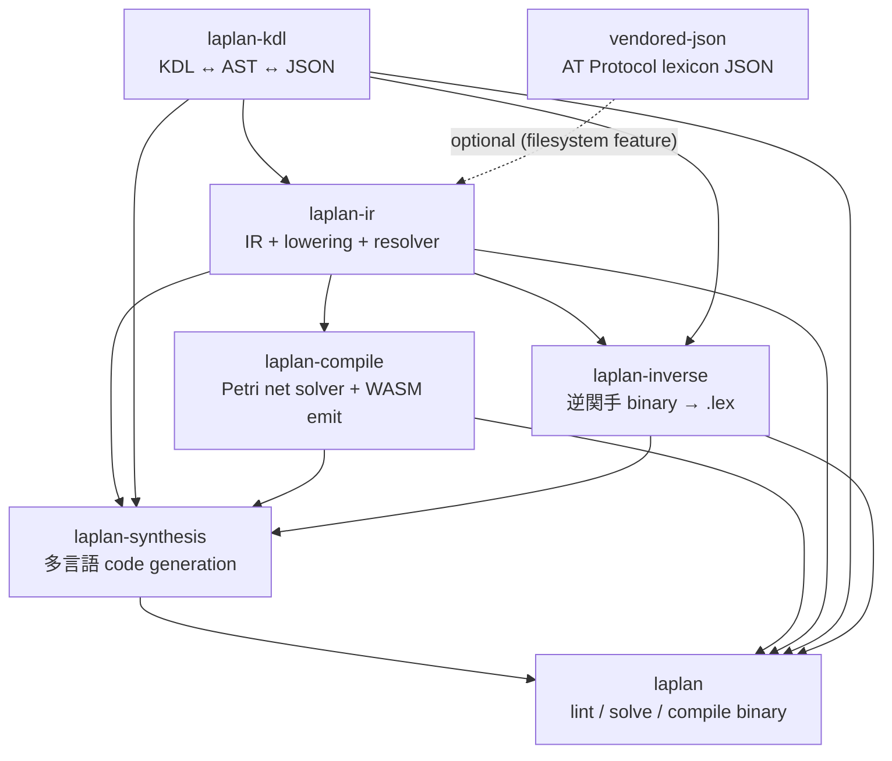
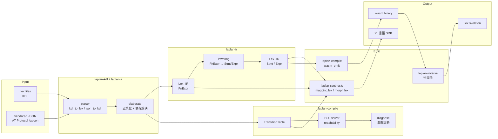

# アーキテクチャ概要

laplan は `.lex` (KDL 方言) で宣言された型と射から、Petri net 到達可能性問題を解き、SDK と WASM バイナリを生成するコンパイラ基盤です。

## crate 依存グラフ

依存方向は一方向で循環がありません。`cli` が全 crate を統合する薄い層で、実装本体は `ir` / `compile` / `synthesis` / `inverse` に集約されています。

## パイプライン

`.lex` から WASM / 多言語 SDK までの全体フローを示します。

### ステージ別の責務

| ステージ | crate | 入力 | 出力 |
|---|---|---|---|
| Parse | `laplan-kdl` | `.lex`, `.json` | 生 AST (KDL node 列) |
| Elaborate | `laplan-ir` | 生 AST | 正規化 IR (`RuleBundle`, `Lexicon`, `Mapping`) |
| Lower | `laplan-ir` | Lex₁ `FnExpr` | Lex₂ `Stmt` / `Expr` |
| Solve | `laplan-compile` | `RuleBundle` + marking | 到達経路 / 診断 |
| Synthesize | `laplan-synthesis` | IR + mapping | 21 言語 SDK |
| Compile | `laplan-compile` | Lex₂ IR | WASM バイナリ |
| Invert | `laplan-inverse` | WASM バイナリ | `.lex` スケルトン |

## 二層 solver

laplan の solver は意図的に **二層構成** で設計されています。

| 層 | 対象 | 探索粒度 | 配置 |
|---|---|---|---|
| Layer 1: morphism solver | Lex₁ の射 (rule, const, assign, chain) | endpoint 単位の合成経路 | `compiler/compile/src/solver.rs` |
| Layer 2: instruction solver | Lex₂ の構造制約 (func, family, law) | 枝刈り・同一視・導出の根拠 | `compiler/compile/src/diagnose.rs`, `axiom_table.rs` |

Lex₁ と Lex₂ の間の **solver boundary** が収束性の鍵です。solver が Lex₁ のみを探索し、Lex₂ を判断材料として使うことで状態空間の爆発を抑えます。層分類の詳細は [reference/layers.md](../reference/layers.md) を参照してください。

## 外部プロジェクトとの接続

laplan は汎用コンパイラ基盤として設計されており、AT Protocol 実装 (neco-atproto) 等の下流プロジェクトが synthesis 出力を取り込んでドメイン固有ロジックを追加します。

- laplan は KDL / JSON / SHA2 等の基盤 crate を依存として利用
- `vendored-json/` は AT Protocol の公式 lexicon JSON を同梱 (`filesystem` feature で有効化)

synthesis の拡張点は [architecture/synthesis.md](synthesis.md) 、solver は [architecture/solver.md](solver.md) を参照してください。
