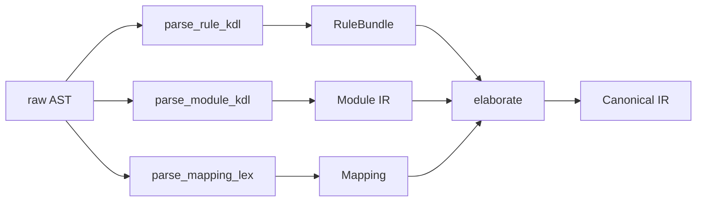

# パーサ

`.lex` (KDL 方言) と AT Protocol lexicon JSON から、正規化された IR に変換するステージです。`laplan-kdl` と `laplan-ir` の 2 crate に分離されています。

## 役割分担

| crate | 責務 | ファイル |
|---|---|---|
| `laplan-kdl` | KDL ↔ AST ↔ Lexicon JSON の相互変換。構文層 | `kdl_to_lex.rs`, `lex_to_kdl.rs`, `kdl_to_json.rs`, `json_to_kdl.rs`, `axiom.rs` |
| `laplan-ir` | AST → IR elaborate。宣言の正規化、依存解決、NSID 解決 | `rule.rs`, `module.rs`, `const_decl.rs`, `chain.rs`, `refinement.rs`, `family.rs`, `fn_expr.rs`, `stmt_expr.rs`, `mapping.rs` |

## laplan-kdl の公開 API

```
pub fn kdl_to_lexicon_json(kdl: &str) -> Result<String, ConvertError>
pub fn lexicon_json_to_kdl(json: &str) -> Result<String, ConvertError>
pub fn lexicon_kdl_to_lex(kdl: &str) -> Result<String, ConvertError>
pub fn lex_to_lexicon_kdl(lex: &str) -> Result<String, ConvertError>
pub fn axiom_kdl_to_json(kdl: &str) -> Result<String, ConvertError>
pub fn delta_kdl_to_json(kdl: &str) -> Result<String, ConvertError>
pub fn serialize_document(doc: &neco_kdl::KdlDocument) -> String
```

- `lexicon_kdl_to_lex` / `lex_to_lexicon_kdl`: AT Protocol lexicon と `.lex` 方言の相互変換
- `axiom_kdl_to_json`, `delta_kdl_to_json`: axiom / delta (refinement) 固有のブロックを JSON に落とす

## .lex 構文の拡張

`.lex` は KDL ベースですが、以下の拡張が加わっています。層分類の詳細は [reference/layers.md](../reference/layers.md) 。

```kdl
// Lex₀: lexicon
lexicon "com.example.foo" version=1 {
    parameters { handle { type=string } }
    output { did { type=string } }
}

// Lex₁: rule / const / assign / chain / refinement
rule "resolve-handle" {
    requires { input { handle } }
    produces { output { did } }
}

const "epoch" { type=i64; value=0 }

morph.chain "register" {
    step "validate-handle"
    step "issue-did"
}

// Lex₂: func / family / law / dual / invariant
func.law "i32.add.comm" {
    forall { a { type=i32 }; b { type=i32 } }
    equation "add(a, b) == add(b, a)"
}

func.family "Complex" {
    product "f32" 2
}

// Lex₃: cratis / import
cratis "my-app" version=1 {
    provides { endpoint "com.example.foo" }
    requires { axiom "i32.add" }
}
```

## KDL → AST の変換ルール

`laplan-kdl` の `kdl_to_lex.rs` で、KDL 特有の記法を AST のフィールドに展開します。

| KDL 記法 | 変換先 |
|---|---|
| `node "name" attr=value { ... }` | AST ノード (name + properties + children) |
| `(type)value` | 型注釈付きリテラル |
| `#true` / `#false` / `#null` | bool / null |
| 文字列の raw 表記 `#"..."#` | そのまま保持 |

特殊扱いされる prefix:
- `morph.*` / `rule.*` / `func.*` / `pkg.*` は層分類プレフィックスとしてトップ層で剥がされる
- 省略形 (`rule`, `chain`, `mapping`, `family`, `law`, `cratis`, `import` 等) は対応する prefix 付き表現に展開される

## laplan-ir の elaborate

AST を走査し、以下を実施します。



| 関数 | 役割 |
|---|---|
| `parse_rule_kdl` | rule / const / assign / handler / chain / refinement / derives の AST → `RuleBundle` |
| `parse_lib_lex` | cratis / face / member 宣言を `LibConfig` に正規化 |
| `parse_family_lex` | family 宣言を `FamilyTable` に展開 (product 展開含む) |
| `parse_build_lex` | build 設定 (`EmitTarget`, `BoundaryRule`) |
| `parse_const_decl_kdl` / `AssignDecl` | const / assign 宣言 |
| `parse_wasm_mapping_kdl` | WASM opcode mapping |
| `parse_resolver_lex` | resolver.lex (KDL) → `Vec<FnDef>` (Lex₁ FnExpr)。[ir.md](ir.md) の「resolver.lex」節を参照 |
| `elaborate` | 全宣言を横断して型接続・依存関係を正規化 |
| `rule_bundle_to_canonical` | AT Protocol 互換の canonical 形式に変換 |

## NSID 解決

`nsid_resolver.rs` が、ファイルパス (`axiom/i32/add.lex`) と NSID (`i32.add`) の相互解決を担います。

- `NsidResolver::from_workspace()` が `ir::paths::axiom_dir()` 経由で axiom ルートを確定
- 言語テンプレート: `compiler/synthesis/builtin/target.lang/`
- bind テンプレート: `compiler/synthesis/builtin/target.bind/`
- binary テンプレート: `compiler/compile/builtin/target.binary/`

## vendored-json との接続

`vendored-json/` crate (`atproto-lexicon-vendored`) は AT Protocol 公式 lexicon JSON を同梱します。`laplan-ir` の `filesystem` feature (デフォルト有効) で取り込まれ、`load_bundled_manifest()` 経由で利用できます。

WASM ビルドなど filesystem が使えない環境では `--no-default-features` で切り離し、呼び出し側が `TransitionTable` を構築します。

## 生成物ヘッダ

synthesis 出力と inverse 出力それぞれに専用ライセンスヘッダが付きます。

```rust
pub const SYNTHESIZED_HEADER: &str;   // synthesis 出力に付与
pub const INVERSE_HEADER: &str;       // 逆変換で生成された .lex に付与
pub fn rewrite_header_prefix(header: &str, prefix: &str) -> String;
```

`rewrite_header_prefix` が言語ごとのコメントプレフィックス (`//`, `--`, `#`, `%%`) に書き換えます。
