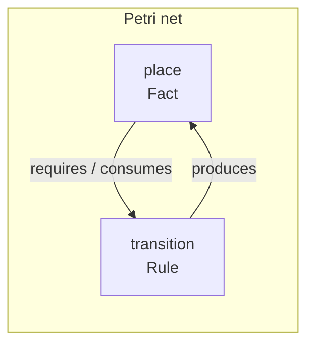
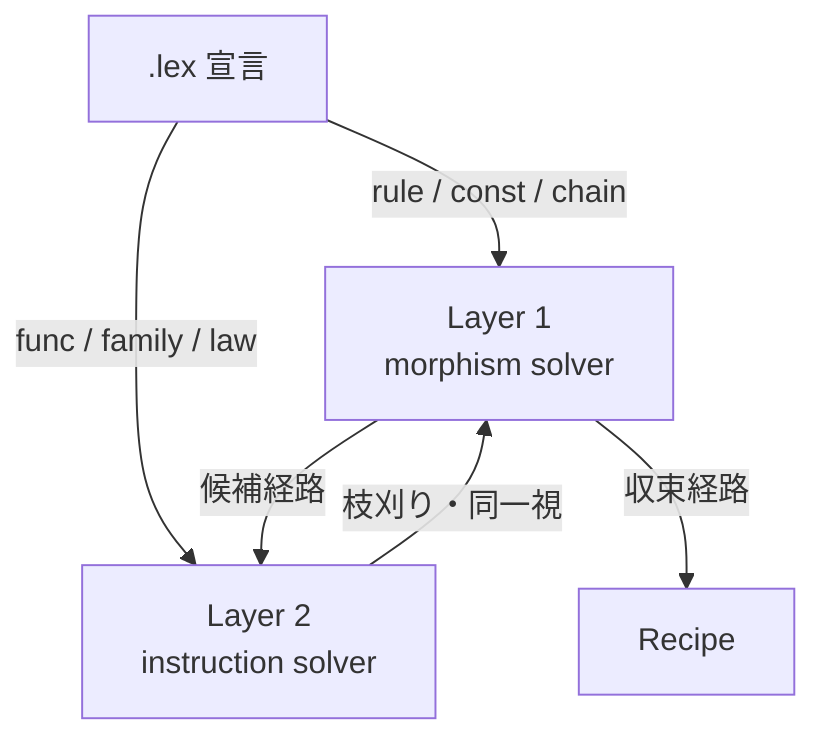
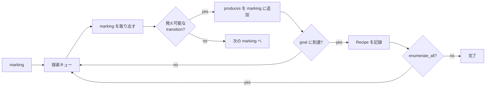

# Petri net solver

laplan の solver は、`.lex` で宣言された rule の requires / produces ネットワークを Petri net と見なし、marking から goal への到達経路を BFS で列挙します。

## Solver が解く問題

solver は 3 つの概念で世界を捉えます。

| 概念 | 意味 | `.lex` での対応 |
|---|---|---|
| Place | 「持っているもの」の種類 | fact (`output`, `capability`, `input` 等) |
| Transition | 「できること」 | rule, const, assign, chain |
| Marking | 「今持っているもの」の集合 | 現時点の fact の集合 |

marking は「今、何を持っているか」のスナップショットです。rule は「何を持っていれば使えるか」(requires) と「使うと何が得られるか」(produces) を宣言します。



solver が答える問いは「初期 marking から、goal で指定した fact の集合を含む状態に到達できるか。できるなら、どの rule をどの順序で使えばよいか」です。

```
初期 marking: { input("handle") }
goal:         { output("profile") }

探索結果:
  input("handle") → [resolve_handle] → output("did")
                   → [get_profile]   → output("profile")
```

到達できない場合、solver は missing facts (不足している fact) を報告します。複数の経路が見つかった場合は全て列挙し、最短経路を優先します。

### 1-safe の意味

laplan の marking は各 fact が「ある」か「ない」かの 2 値です (1-safe Petri net)。同じ fact を 2 つ持つことはありません。この制約により探索空間が有限に収まり、`max_depth` の制限と合わせて solver は必ず停止します。

## 実装の詳細

### Fact の種別

| 概念 | 対応する型 | 対応する .lex 宣言 |
|---|---|---|
| place | `Fact` | `lexicon` の output / input / capability 等 |
| transition | `Transition` | `rule`, `const`, `assign`, `chain`。endpoint に対応しない standalone rule は `add_standalone_rules` で追加 |
| token | `Fact` の instance | marking の要素 |
| marking | `Marking = BTreeSet<Fact>` | solver の現在状態 |
| goal | `Goal = Vec<Fact>` | endpoint / 自由指定 |
| firing | `Recipe` | 到達経路の 1 step |

```rust
pub enum Fact {
    Capability(String),
    CapabilityExpired(String),
    Output(String),
    SelfKey(String),
    Input(String),
    Selected(String),
}
```

`goal <kind>:<value>` の書式 (CLI) は、この enum variant に対応します。

## 二層 solver

laplan の solver は **二層構成** で、Lex₁ の射と Lex₂ の構造制約を異なる層で扱います。



| 層 | 対象 | データ | ファイル |
|---|---|---|---|
| Layer 1: morphism solver | Lex₁ の射 (rule, const, assign, chain) | `Transition`, `Fact`, `Marking` | `solver.rs`, `axiom_table.rs`, `fact.rs` |
| Layer 2: instruction solver | Lex₂ の命令レベル同値性 | `InstructionTransition`, `InstructionFact`, `InstructionMarking` | `solver.rs` (同ファイル内), `diagnose.rs`, `assessment.rs` |

`SearchTransitionLike` trait で両層を統一的に扱い、`Fact` / `InstructionFact` のどちらでも同じ BFS コアが動作します。

`InstructionFact` は `Value { ty, name }` と `SimdValue { ty, name, lanes }` の 2 variant で、SIMD 最適化・並列化の等価性判定に使われます。

## BFS 探索



### SearchConfig

```rust
pub struct SearchConfig {
    pub allow_duplicate_steps: bool,
    pub enumerate_all: bool,
}

pub enum SolveMode { Execute, DryRun }
```

| フィールド | 効果 |
|---|---|
| `allow_duplicate_steps` | 同じ transition を複数回発火可能にする (instruction level 向け) |
| `enumerate_all` | 最短経路で止めず `max_depth` まで全経路を列挙 |

`SearchConfig::instruction_level()` は両方を有効化したプリセットです。

### 主要 API

```rust
// compile/api.rs
pub fn solve(marking: Marking, goal_spec: &str, table: &TransitionTable) -> SolveOutput;
pub fn solve_module_endpoint(...) -> SolveOutput;
pub fn marking_from_json(marking: &HashMap<String, String>) -> Marking;

// TransitionTable 側のメソッド (diagnose.rs)
impl TransitionTable {
    pub fn search(&self, marking: Marking, goal: &[Fact], max_depth: usize) -> Vec<Recipe>;
    pub fn search_all(&self, marking: Marking, goal: &[Fact], max_depth: usize) -> Vec<Recipe>;
    pub fn search_dry_run(&self, marking: Marking, goal: &[Fact], max_depth: usize) -> Vec<Recipe>;
    pub fn diagnose(&self) -> Vec<NeedsDiagnostic>;
    pub fn diagnose_convergent_paths(&self, max_depth: usize) -> Vec<NeedsDiagnostic>;
    pub fn diagnose_goal(&self, goal: &[Fact]) -> Vec<GoalDiagnostic>;
    pub fn diagnose_laws(/* ... */);
    pub fn add_standalone_rules(&mut self, rules: &[Rule]);
}
```

`search` は最短経路を返し、`search_all` は `max_depth` までの全経路、`search_dry_run` は副作用を発生させずに経路のみ確認します。

## SolveOutput

```rust
pub enum SolveOutput {
    Ok(Vec<Recipe>),
    AlreadySatisfied,
    PreflightRequired { recipe, axiom_nsids },
    AmbiguousAxiomCrossing { candidates, axiom_nsids },
    NeedsUserAction(Vec<Fact>),
    Boundary(BoundaryKind),
    InvalidGoalSpec { goal_spec },
}
```

| variant | 意味 |
|---|---|
| `Ok` | 経路を発見 |
| `AlreadySatisfied` | marking が既に goal を満たす |
| `PreflightRequired` | axiom 境界を越えるために preflight 必要 |
| `AmbiguousAxiomCrossing` | 複数候補があり一意決定不能 |
| `NeedsUserAction` | ユーザー入力 (input / selected) が不足 |
| `Boundary` | client / server 境界をまたぐ要求 |
| `InvalidGoalSpec` | ゴール指定の構文エラー |

## 枝刈り

Lex₂ の構造制約は、solver が探索する Lex₁ 空間を絞り込みます。

| 制約 | 効果 |
|---|---|
| `inverse` | 逆射を持つ経路の片方を省略 |
| `func.law` | 等価な経路を同一視。代数法則による対称性削減 |
| `func.family` | product / vectorize の成分展開で重複経路を統合 |
| `boundary` | client / server の分離で探索空間を分割 |
| `invariant` | count 整合性等の不変量で違反経路を排除 |

## 診断 (Layer 2)

`diagnose.rs` が Layer 2 の構造検査を担います。

| 診断 | 意味 |
|---|---|
| `MissingProduces` | endpoint の output を `produces` に持つ rule が存在しない |
| `ConvergentPaths` | 同一 goal に異なる深さで到達する経路が複数存在 |
| `DeadBridge` | bridge rule の前提 fact が欠落 |
| `SubtypeCycle` | subtype 関係に循環 |
| `TimedCapabilityNoRenewal` | TTL 付き capability に更新経路なし |
| `LawTargetNotFound` | law が参照する target rule が未定義 |

`diagnose_convergent_paths` は計算量が大きいため `diagnose` とは別に呼び出します。

## Layer 0 lint

`lint.rs` は Petri net を構築せず、`.lex` 宣言の well-formedness のみを検査します。

| 種別 | 検出内容 |
|---|---|
| `OrphanOutput` | 他 endpoint に接続されない output |
| `UnsatisfiedInput` | 対応 output のない input |
| `TypeConnection` | フィールド名一致による情報提示 |

CLI からは `laplan lint <dir>` で実行します。詳細は [architecture/cli.md](cli.md) 。

## 並列 DAG

`concurrency.rs` が transition 間の依存関係を解析し、並列実行可能な DAG を構築します。

```rust
pub fn build_parallel_dag(transitions: &[Transition]) -> ParallelDag;
pub fn are_independent(a: &Transition, b: &Transition) -> bool;
pub fn has_dependency(a: &Transition, b: &Transition) -> bool;
```

`bake --parallel` で WASM に並列 DAG を組み込みます。詳細は [architecture/compiler.md](compiler.md) 。

## TransitionTable 構築

| 方法 | ファイル | feature |
|---|---|---|
| `bundled_table()` | `bundle.rs` | `bundle` (default) |
| 手動構築 | `morphisms_to_transitions` (`axiom_table.rs`) | 常に利用可 |

WASM ビルドなど `bundle` feature を切る場合、呼び出し側が `morphisms_to_transitions` を経由して `TransitionTable` を組み立てます。

---

## 形式的定義

ここから先は solver の動作を数学的に定式化します。上記の説明で十分な場合は読み飛ばせます。

### Petri net の定義

Petri net は 4 つ組 $N = (P, T, F, W)$ で定義されます。

- $P$: 有限の place 集合
- $T$: 有限の transition 集合 ($P \cap T = \emptyset$)
- $F \subseteq (P \times T) \cup (T \times P)$: flow relation
- $W: F \to \mathbb{N}^{+}$: アーク重み

marking は $M: P \to \mathbb{N}$ で各 place のトークン数を与えます。

### 発火規則

transition $t$ は次を満たすとき enabled です。

$$
\forall p \in {}^\bullet t : M(p) \geq W(p, t)
$$

発火後の marking $M'$:

$$
M'(p) = M(p) - W(p, t) + W(t, p)
$$

laplan は 1-safe ($M: P \to \{0, 1\}$, $W = 1$) なので、これは以下に単純化されます。

$$
t \text{ enabled at } M \iff \text{requires}(t) \subseteq M
$$

$$
M' = (M \setminus \text{consumes}(t)) \cup \text{produces}(t)
$$

`consumes` が空なら marking は単調増加します。`consumes` が非空の場合は token が除去され、有効期限付き capability の失効などが表現されます。

### 到達可能性問題

初期 marking $M_0$ と目標 $M_g$ に対し、

$$
M_0 \xrightarrow{t_1} M_1 \xrightarrow{t_2} \cdots \xrightarrow{t_n} M_n \supseteq M_g
$$

を満たす発火列 $t_1, t_2, \ldots, t_n$ を求めます。goal は marking そのものではなく、$M_n$ が含むべき fact の集合として与えられます。

### 決定可能性

1-safe Petri net の到達可能性は EXPSPACE-complete です。laplan は以下の制約により実用上扱えます。

1. `max_depth` で探索を打ち切る
2. Lex₂ 制約による枝刈りで状態空間を削減
3. エンドポイント単位の goal 分解で問題を分割

### Lean 形式検証

solver の健全性は Lean 4 で以下が証明されています。

- 経路は到達可能性の構成的証明であること
- 制約 (law, invariant) を加えると到達可能性の等価類が細分化されること
- 注釈 (capability, ownership) は型から復元不能であること

### 参考文献

- Murata, T. "Petri Nets: Properties, Analysis and Applications", Proc. IEEE, 1989
