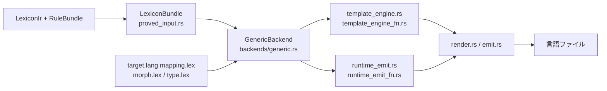

# 多言語 synthesis

`laplan-synthesis` は IR から 21 言語の SDK と WASM バインディングを生成するコンパイラ後半です。言語ごとの差分は `axiom/target/lang/{lang}/` の宣言的テンプレートで管理され、Rust コード側は `GenericBackend` で統一的に駆動されます。

## パイプライン



### 入力ビルダ

- `load_proved_bundle_from_path` / `load_proved_bundle_from_json` (`proved_input.rs`): 証明済み入力 JSON から `LexiconBundle` を構築
- `build_lexicon_bundle`: IR 直接から `LexiconBundle`

### 出力エントリ

- `render_neutral_module` / `render_full_module_for_target`: ターゲット未依存 IR と言語別成果物の両方を吐く
- `write_rendered_module_artifacts`: ディスクに書き出し
- `generate_recipe_manifest` / `write_rust_mod_tree`: モジュールツリーと manifest
- `export_lean_from_ir`: Lean 形式検証入力

## GenericBackend

`backends/generic.rs` の `GenericBackend` が、mapping.lex / morph.lex / type.lex を読み込んで言語出力のテンプレートを保持します。

```rust
pub struct GenericBackend { /* mapping, type_map, morph_overrides, ... */ }

pub fn all_mapping_names() -> &'static [&'static str];   // 対応言語一覧
pub fn generic_backend_for_target(target: &str) -> Option<GenericBackend>;
pub fn cached_mapping(target: &str) -> &'static Mapping;
pub fn profile_for(target: &str) -> LanguageProfile;
pub fn render_stub(target: &str, ...) -> String;
```

言語ごとの `GenericBackend` インスタンスが `render.rs` と `runtime_emit.rs` から呼ばれ、フォーマッタとしてテンプレート文字列を穴埋めします。

## axiom/target/lang の役割

```
axiom/target/lang/{lang}/
├── mapping.lex    # 型・構文・制御・handler テンプレート
├── morph.lex      # 射 (axiom 呼び出し) の実装パターン
├── type.lex       # 追加の型宣言
└── cli templates は `mapping.lex` の `cli { ... }` に置く
```

### mapping.lex のセクション

| セクション | 役割 |
|---|---|
| `extension` | 出力ファイル拡張子 (`"rs"`, `"ts"`, ...) |
| `keywords strict` | 予約語。識別子衝突検査に使用 |
| `keywords builtins` | 言語組込型 |
| `file-collisions` | 予約されるファイル名 |
| `identifier-escape` | 衝突時のエスケープ (`prefix="r#"` 等) |
| `syntax { product, sum, alias }` | 型宣言テンプレート |
| `control { if, for, fn, module }` | 制御構文 |
| `variable { binding, mutable-binding, assign, return }` | 束縛・代入 |
| `functional { let-in, match, ... }` | Lex₁ パス (関数型言語のみ) |
| `handler` | endpoint ハンドラ trait |
| `bindings` | 外部ライブラリマッピング |
| `stub-template` | スタブコード |
| `lowering` | `fst` / `snd` / `from-maybe` 等の lowering テンプレート |

### template 変数

mapping.lex の文字列テンプレートで使える変数:

| 変数 | 意味 |
|---|---|
| `{gen}` | `generated-subdir` の basename (例: `synth`) |
| `{Gen}` | `{gen}` の先頭大文字 (例: `Synth`)。Elixir 等 PascalCase 用 |
| `{name}`, `{Name}`, `{NAME}` | 小文字 / PascalCase / 大文字 |
| `{type}`, `{return_type}`, `{params}` | 型・シグネチャ |
| `{cond}`, `{var}`, `{collection}` | 制御構文の埋め込み |

`Mapping::expand_gen_placeholder` (`ir/mapping.rs`) が `{gen}` / `{Gen}` を実値に展開します。

## Lex₁ パス vs Lex₂ パス

| パス | 対象言語 | IR | 生成器 |
|---|---|---|---|
| Lex₁ | Haskell, OCaml, Gleam, Elixir | `FnExpr` | `axiom/resolver.lex` → `parse_resolver_lex`, `template_engine_fn.rs`, `runtime_emit_fn.rs` |
| Lex₂ | 残り 17 言語 + WASM | `Stmt` / `Expr` | `lowering.rs` (Lex₁→Lex₂ 自動降格), `template_engine.rs`, `runtime_emit.rs` |

`has_functional_templates()` が mapping.lex に `functional {}` セクションがあるかで自動分岐します。

Lex₂ パスは lowering による自動生成のみで構成されます。resolver 7 関数は `axiom/resolver.lex` (KDL) で定義されています。詳細は [architecture/ir.md](ir.md) の「resolver.lex」節。

### runtime dispatch のフィールド名

`MappingRuntime` の構造体フィールド名と mapping.lex のキー名は `runtime_solve_*` (`runtime_solve_header`, `runtime_solve_module_name`, `runtime_solve_filename`) です。生成される出力ファイル名と出力内の関数名は `resolve` を使用します。この名前の不一致は既知の仕様です。mapping.lex を編集する際は `runtime_solve_*` のキー名を使用してください。

## 対応言語テーブル

対応 21 言語: `clojure`, `cpp`, `csharp`, `d`, `dart`, `elixir`, `gleam`, `go`, `haskell`, `java`, `javascript`, `kotlin`, `lua`, `ocaml`, `php`, `python`, `ruby`, `rust`, `swift`, `typescript`, `zig` 。

| Capability Level | 対応範囲 |
|---|---|
| L1 type | 型宣言のみ (product, sum, alias) |
| L2 interface | handler trait + effect 型の生成 |
| L3 recipe | recipe manifest + dispatch |
| L4 solver | Goal synthesis 実行 |

各言語の対応レベルは [reference/target-languages.md](../reference/target-languages.md) 。

## binding 層

`bind_typescript.rs`, `bind_python.rs`, `bind_server.rs` (atproto-server feature gate) が WASM に対する言語バインディングを生成します。

```rust
pub fn generate_typescript_bindings(...) -> TypeScriptBindings;
pub fn generate_python_bindings(...) -> PythonBindings;
#[cfg(feature = "atproto-server")]
pub fn generate_server_bindings(...) -> ServerBindings;
```

bind 対象言語のテンプレートは `axiom/target/bind/{lang}/` に置かれ、`bind_mapping.rs` で駆動されます。

## feature gate: atproto-server

`atproto-server` feature (デフォルト有効) は AT Protocol サーバ固有の生成を隔離します。

| モジュール | 内容 |
|---|---|
| `server_output.rs` | サーバ実装 (routes, handlers, bridge traits, chain impls, probe impls) |
| `execution.rs` | ExecutionNode, ProofWitness |
| `bind_server.rs` | server 用バインディング |
| `package_audit.rs` | 公開パッケージの audit |

`--no-default-features` で emit 専用ビルドが可能です。

## Lean エクスポート

`lean_export.rs` の `export_lean_from_ir` が、lexicon IR を Lean 4 の `LexiconCode` に変換します。Lean 形式検証プロジェクトとの接続点です。

## 追加の emit

| 機能 | ファイル |
|---|---|
| WGSL (WebGPU shader) | `wgsl_emit.rs` |
| WASM 直接 emit | `wasm_emit.rs`, `wasm_lower.rs` |
| Rust 固有ユーティリティ | `rust/` |
| 旧 lang 固有ヘルパ | `lang/` |
