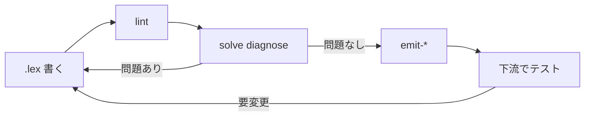

# 入門

laplan のビルド、最初の `.lex` 宣言、lint / solve / synthesis の基本ワークフローをまとめます。

## ビルド

```bash
git clone <laplan-repo>
cd laplan
cargo build --release
```

`laplan` バイナリは `compiler/cli` から配布されます。

```bash
cargo run -p laplan-cli -- --help
cargo run -p laplan-cli -- lint lexicon
```

開発中は `cargo run -p laplan-cli -- <command>` で実行できます。

### チェック項目

```bash
cargo check -p laplan-ir -p laplan-synthesis -p laplan-cli     # 基本確認
cargo check -p laplan-synthesis --no-default-features          # emit 専用ビルド
cargo check -p laplan-ir --no-default-features                 # WASM 向け ir
cargo test -p laplan-synthesis --lib runtime_emit              # Lex₂ 回帰
cargo test -p laplan-synthesis --lib runtime_program_fn        # Lex₁ 回帰
```

## 最初の `.lex`

axiom 下に任意のディレクトリを作り、`rule.lex` と `lexicon` を書いてみます。

### lexicon 定義

```kdl
// lexicon/sample/get-user.lex
lexicon "sample.get-user" version=1 {
    query {
        params { handle { type=string; required=#true } }
        output { did { type=string } }
    }
}
```

### rule 定義

```kdl
// lexicon/sample/rule.lex
rule "resolve-handle" {
    requires { input { handle } }
    produces { output { did } }
}
```

## lint

```bash
cargo run -p laplan-cli -- lint lexicon/sample
```

Layer 0 静的検査で、OrphanOutput / UnsatisfiedInput / TypeConnection を報告します。詳細は [architecture/cli.md](../architecture/cli.md) 。

## solve

### 構造診断

```bash
cargo run -p laplan-cli -- solve diagnose lexicon/sample --max-depth 8
```

全 endpoint について構造問題 (MissingProduces, DeadBridge, SubtypeCycle, ConvergentPaths 等) を報告します。

### 経路列挙

```bash
cargo run -p laplan-cli -- solve paths lexicon/sample sample.get-user
```

endpoint ごとに深さ別の到達経路を表示します。

### 到達可能集合

```bash
cargo run -p laplan-cli -- solve reachable lexicon/sample --from '{"handle":""}'
```

marking から到達可能な全 fact を深さ付きで列挙します。

### 自由ゴール

```bash
cargo run -p laplan-cli -- solve goal lexicon/sample "output:did" --from '{"handle":""}'
```

endpoint に縛られないゴール指定で経路を探索します。

## synthesis

synthesis は cratis 単位で動きます。まず cratis を宣言します。

```kdl
// lexicon/sample/cratis.lex
cratis "sample" version=1 {
    provides { endpoint "sample.get-user" }
}
```

cratis の書き方は [guide/cratis.md](cratis.md) 。

### 多言語 SDK 生成

CLI からは `generate` サブコマンドで emit します。`--target` に言語名を指定します。

```bash
cargo run -p laplan-cli -- generate --lexicon-dir lexicon/sample --output out/rust/ --target rust
cargo run -p laplan-cli -- generate --lexicon-dir lexicon/sample --output out/ts/ --target typescript
```

`--target` を省略すると 21 言語をまとめて emit します。対応言語の一覧は [reference/target-languages.md](../reference/target-languages.md) 、サブコマンド詳細は [architecture/cli.md](../architecture/cli.md) 。

### WASM bake

```bash
cargo run -p laplan-cli -- emit-wasm --bake \
    --module-dir lexicon/sample \
    --output out/sample.wasm
```

追加フラグ:

- `--simd`: SIMD 最適化
- `--parallel`: 並列 DAG 組込み
- `--constant-time`: 定数時間実行
- `--bind typescript --bind-output out/bind/`: TypeScript バインディング
- `--server-output out/server/`: サーバ実装 stub

詳細は [architecture/compiler.md](../architecture/compiler.md) 。

## VSCode 拡張

`.lex` のシンタックスハイライト、inlay hints、Petri net 可視化を提供する拡張が `extension/` にあります。ビルドと導入手順は [guide/wasm-extension.md](wasm-extension.md) 。

## 典型的ワークフロー



1. `.lex` を書く
2. `lint` で静的エラーを潰す
3. `solve diagnose` で経路と構造制約を検証
4. `emit-*` で SDK / WASM を生成
5. 下流プロジェクト (neco-atproto 等) で利用
6. 問題があれば `.lex` に戻って修正

`.lex` 層の分類と判定基準は [reference/layers.md](../reference/layers.md) 、solver の仕組みは [architecture/solver.md](../architecture/solver.md) 。
