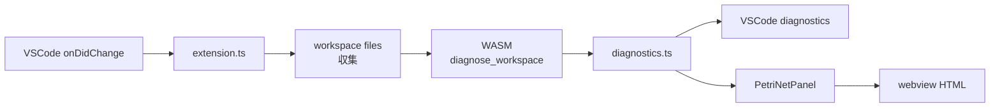

# VSCode 拡張と WASM

`extension/` に VSCode 拡張があり、`.lex` のシンタックスハイライト、diagnostics、semantic tokens、inlay hints、Petri net webview を提供します。本体は WASM で、`compiler/ir` / `compile` / `synthesis` を呼び出します。

## ビルド

```bash
cd extension
npm install
npm run build:wasm    # wasm-pack build
npm run compile       # tsc
npm run package       # wasm + tsc + vsix
```

成果物:

- `extension/wasm-pkg/`: `wasm-pack` 出力 (gitignore 済み)
- `extension/laplan-lex-<version>.vsix`: 配布用パッケージ

## 構成

```
extension/
├── src/
│   ├── extension.ts            # エントリポイント
│   ├── diagnostics.ts          # WASM 結果 → VSCode diagnostics
│   ├── graph/
│   │   ├── types.ts            # 描画非依存グラフモデル
│   │   └── petriNetPanel.ts    # WebviewPanel 管理
│   └── webview/
│       ├── renderer.ts         # Renderer インターフェース
│       └── cytoscapeRenderer.ts
├── wasm/
│   └── src/lib.rs              # WASM API
├── syntaxes/                   # TextMate 文法
└── language-configuration.json
```

### WASM API

`extension/wasm/src/lib.rs` が WASM のエクスポート面です。

```rust
#[wasm_bindgen]
pub fn diagnose_workspace(files: &JsValue) -> JsValue;
```

返値:

```ts
type WorkspaceReport = {
    diagnostics: Diagnostic[];
    lints: Lint[];
    connections: Connection[];
    graph: {
        transitions: GraphTransition[];
        parallel_dag: ParallelDagData;
        subtypes: Subtype[];
        cratis: CratisEntry[];
    };
};
```

extension 側は `laplan-ir` / `laplan-compile` / `laplan-synthesis` を `--no-default-features` 相当でリンクします。filesystem に依存する機能は extension で持たず、workspace のファイル内容は JS 側から渡します。

### TypeScript 側の流れ



### Petri net webview

- `graph/types.ts`: 描画ライブラリ非依存のデータモデル (`PetriNetGraph`, `GraphTransition`, ...)
- `graph/petriNetPanel.ts`: WebviewPanel 管理。Cytoscape.js を bundled 提供。CSP nonce で保護
- `webview/renderer.ts`, `cytoscapeRenderer.ts`: Renderer インターフェースと参照実装
- 実描画は `petriNetPanel.ts` 内の inline JS が担当

### WebGPU への差し替え

`webview/renderer.ts` は Renderer インターフェースを定義し、Cytoscape 実装はその 1 例です。将来的に WebGPU Renderer に差し替え可能な構造になっています。

## 機能

| 機能 | 実装 |
|---|---|
| シンタックスハイライト | `syntaxes/` (TextMate) |
| diagnostics | `diagnose_workspace` → VSCode Diagnostic Provider |
| semantic tokens | WASM API 経由 |
| inlay hints | WASM API 経由で型注釈を挿入 |
| Petri net 可視化 | `PetriNetPanel` + Cytoscape |
| コマンド: `laplan.showGraph` 等 | `extension.ts` |

## `.vsix` のインストール

```
code --install-extension extension/laplan-lex-0.2.0.vsix
```

バージョンは `package.json` の `version` と同期します。

## トラブルシューティング

| 症状 | 対処 |
|---|---|
| `wasm-pkg` が無い | `npm run build:wasm` を実行 |
| extension がロードされない | `.vsix` の再インストール、VSCode 再起動 |
| diagnostics が更新されない | VSCode の `Developer: Reload Window` |
| Petri net が表示されない | webview の console を `Help > Toggle Developer Tools` で確認 |

## 関連

- [architecture/solver.md](../architecture/solver.md): diagnose / lint の中身
- [architecture/synthesis.md](../architecture/synthesis.md): WASM binding の生成
